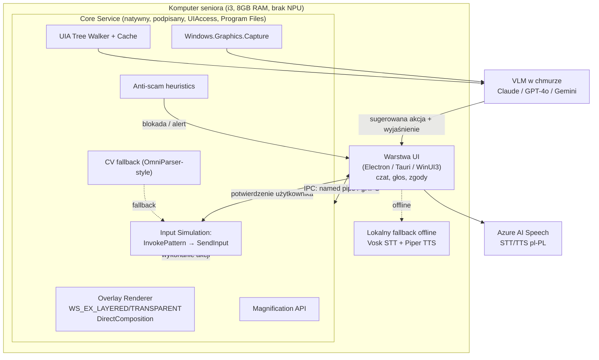

# SeniorAI — Analiza wykonalności technicznej nakładki (overlay) na Windows dla seniorów

**Data:** 2026-09-07
**Zakres:** weryfikacja techniczna 7 grup wymagań produktowych, z konkretnymi API i ograniczeniami.
**Metoda:** przegląd dokumentacji (priorytet: learn.microsoft.com), publikacji naukowych (arXiv) i benchmarków branżowych. Wszystkie liczby benchmarkowe pochodzą z cytowanych źródeł — tam gdzie danych nie udało się zweryfikować w 100% (wyczerpany budżet zapytań w trakcie researchu), zaznaczono to wprost zamiast zgadywać.

---

## 1. Executive summary

**Werdykt ogólny: PROJEKT WYKONALNY, ale wyłącznie jako system "asystent z potwierdzeniem", nie jako system autonomiczny.** Żadna pojedyncza część nie jest "niemożliwa", ale trzy elementy są *bardzo trudne* inżynieryjnie (hybryda UIA+CV, natywny overlay wysokiej jakości, wykrywanie scamów), a jeden wymóg — "kliknięcie w oknie UAC" — jest **twardo niemożliwy z definicji bezpieczeństwa Windows** i musi zniknąć z zakresu produktu w obecnej architekturze.

Skala wykonalności użyta w tym dokumencie: **proste** (istnieje gotowe, udokumentowane API, typowy use-case) / **trudne** (API istnieje, ale wymaga nietrywialnej integracji, podpisów, uprawnień lub ma znane ograniczenia) / **bardzo trudne** (wymaga łączenia kilku niepewnych technologii, dużego nakładu inżynieryjnego lub ma niską skuteczność w praktyce) / **niemożliwe dziś** (blokada architektoniczna Windows lub brak dojrzałej technologii).

| Wymóg produktowy | Werdykt |
|---|---|
| Przezroczysty overlay z click-through rysujący ramki/strzałki | **trudne** (rozwiązania istnieją, ale żadne nie jest "z pudełka" bezproblemowe) |
| Wykrywanie elementów UI i ich współrzędnych | **trudne → bardzo trudne** w zależności od aplikacji docelowej (patrz: aplikacje bez UIA) |
| Lupa / powiększenie fragmentu ekranu | **proste → trudne** (API dojrzałe, ale pełna funkcjonalność wymaga UIAccess) |
| Asystent głosowy PL (STT+TTS) | **proste** w chmurze, **trudne** offline |
| AI analizujące zrzut ekranu | **trudne**, ale **autonomiczne wykonywanie zadań na tej podstawie = bardzo trudne / niewiarygodne dziś** (patrz benchmarki w sekcji 7) |
| Częściowe przejęcie kontroli z potwierdzeniem | **trudne** (technicznie wykonalne, wymaga UIPI/UIAccess) |
| Blokowanie niebezpiecznych akcji (w tym scam) | **bardzo trudne** — nie istnieje gotowe API "wykryj oszustwo"; to autorska logika na bazie sygnałów z innych warstw |
| Kliknięcie okna UAC / secure desktop | **NIEMOŻLIWE DZIŚ** — świadome ograniczenie bezpieczeństwa Windows, nie da się obejść żadnym podpisem ani uprawnieniem |

Najważniejszy wniosek dla zarządu produktu: **wszystkie niezależne benchmarki agentów komputerowych (WindowsAgentArena — benchmark autorstwa samego Microsoftu — pokazuje 19,5% skuteczności agenta wobec 74,5% skuteczności człowieka) potwierdzają, że pełna autonomia AI na pulpicie Windows nie jest dziś wiarygodna.** To nie jest tylko wybór ostrożnościowy — to twardy sufit techniczny. Model "AI sugeruje i podświetla, człowiek potwierdza każdą akcję" nie jest tylko bezpieczniejszy dla seniora — jest to *jedyny* model, który obecna technologia realnie wspiera.

---

## 2. Tabela zbiorcza: funkcja → API → wykonalność → ograniczenia → źródło

| Funkcja | API / technologia | Wykonalność | Twarde ograniczenia | Źródło |
|---|---|---|---|---|
| Przezroczyste okno click-through | `WS_EX_LAYERED` + `WS_EX_TRANSPARENT` + `WS_EX_NOACTIVATE` | proste | mieszanie `UpdateLayeredWindow` z `SetLayeredWindowAttributes` na tym samym oknie psuje się nawzajem | [Window Features](https://learn.microsoft.com/en-us/windows/win32/winmsg/window-features) |
| Rysowanie z alpha-blendingiem | `UpdateLayeredWindow` | proste | wymaga ręcznego zarządzania bitmapą DIB | [docs](https://learn.microsoft.com/en-us/windows/win32/api/winuser/nf-winuser-updatelayeredwindow) |
| Overlay wysokiej wydajności | DirectComposition (`IDCompositionDevice`) | trudne | wyższy próg wejścia (Direct3D), ale najlepsza wydajność i płynny per-pixel alpha | [Basic concepts](https://learn.microsoft.com/en-us/windows/win32/directcomp/basic-concepts) |
| Overlay w WinUI 3 | brak natywnego `AllowsTransparency` | bardzo trudne | trzeba ręcznie P/Invoke'ować Win32; otwarte, nierozwiązane issue w repo | [microsoft-ui-xaml#7276](https://github.com/microsoft/microsoft-ui-xaml/issues/7276) |
| Overlay w WPF | `Window.AllowsTransparency=true` | trudne | wymaga `WindowStyle=None`; wymusza software rendering dla okna | [AllowsTransparency](https://learn.microsoft.com/en-us/dotnet/api/system.windows.window.allowstransparency) |
| Overlay w Electron | `transparent` + `alwaysOnTop` + `setIgnoreMouseEvents` | trudne | kilka otwartych bugów produkcyjnych (2026); nie daje dostępu do UIA/Magnification | [Electron a11y docs](https://www.electronjs.org/docs/latest/tutorial/accessibility) |
| Overlay w Tauri | `set_ignore_cursor_events()` + `set_always_on_top()` | trudne | mniejszy ekosystem, mniej "battle-tested" niż WPF | [Tauri Window API](https://docs.rs/tauri/latest/tauri/window/struct.Window.html) |
| Overlay nad UAC prompt | — | **niemożliwe dziś** | secure desktop renderuje wyłącznie proces na poziomie integralności SYSTEM; żaden proces user-mode nie może na nim rysować | [UAC on Secure Desktop](https://learn.microsoft.com/en-us/archive/blogs/uac/user-account-control-prompts-on-the-secure-desktop) |
| Ukrycie okna przed przechwyceniem (DRM) | `SetWindowDisplayAffinity(WDA_EXCLUDEFROMCAPTURE)` | proste (dla właściciela okna) | z punktu widzenia SeniorAI: **blokuje** nasz odczyt pikseli takiego okna | [SetWindowDisplayAffinity](https://learn.microsoft.com/en-us/windows/win32/api/winuser/nf-winuser-setwindowdisplayaffinity) |
| Wykrywanie elementów UI (natywne) | UI Automation (`IUIAutomation`, `TreeWalker`, `CacheRequest`) | trudne | wolne bez cache'owania (cross-process); niedziała dla części Electron/Java/legacy Win32 | [UI Automation caching](https://learn.microsoft.com/en-us/windows/win32/winauto/uiauto-cachingforclients) |
| Wykrywanie elementów UI (fallback CV) | OmniParser / OmniParser V2 (Microsoft) | bardzo trudne | 39,5% na ScreenSpot-Pro (trudny benchmark) — nie "widzi" wszystkiego niezawodnie | [OmniParser paper](https://arxiv.org/abs/2408.00203) |
| Przechwytywanie ekranu (nowoczesne) | `Windows.Graphics.Capture` (WGC) | proste | domyślnie żółta ramka (wskaźnik prywatności) | [Screen capture docs](https://learn.microsoft.com/en-us/windows/apps/develop/media-authoring-processing/screen-capture) |
| Przechwytywanie ekranu (niskopoziomowe) | Desktop Duplication API (DXGI) | trudne | brak współdzielenia GPU (musi być ten sam adapter co ekran) | [Desktop Duplication API](https://learn.microsoft.com/en-us/windows-hardware/drivers/display/desktop-duplication-api) |
| Lupa ekranu | Magnification API (`MagSetWindowSource`, `MagSetFullscreenTransform`) | proste | nie działa pod WOW64 (wymaga natywnego x64/ARM64) | [Magnification API Overview](https://learn.microsoft.com/en-us/windows/win32/winauto/magapi/magapi-intro) |
| Poprawne mapowanie dotyku w lupie | `MagSetInputTransform` | trudne | wymaga UIAccess=true (podpis Authenticode + instalacja w Program Files) | [MagSetInputTransform](https://learn.microsoft.com/en-us/windows/win32/api/magnification/nf-magnification-magsetinputtransform) |
| Symulacja kliknięcia (surowa) | `SendInput` | proste | blokowana przez UIPI między różnymi poziomami integralności | [SendInput](https://learn.microsoft.com/en-us/windows/win32/api/winuser/nf-winuser-sendinput) |
| Symulacja kliknięcia (solidna) | `IUIAutomationInvokePattern::Invoke` | trudne | działa tylko gdy kontrolka eksponuje pattern (czyli tylko z UIA) | [InvokePattern](https://learn.microsoft.com/en-us/windows/win32/api/uiautomationclient/nf-uiautomationclient-iuiautomationinvokepattern-invoke) |
| Sterowanie oknem podwyższonym (admin) | UIAccess w manifeście | bardzo trudne | wymaga certyfikatu Authenticode, instalacji w Program Files, **oraz** braku pakowania jako MSIX/Store | [Security Considerations for AT](https://learn.microsoft.com/en-us/windows/win32/winauto/uiauto-securityoverview) |
| STT/TTS po polsku (chmura) | Azure AI Speech (`pl-PL`) | proste | tylko 3 głosy neuronowe pl-PL (Agnieszka, Marek, Zofia) | [Language support](https://learn.microsoft.com/en-us/azure/ai-services/speech-service/language-support) |
| STT/TTS offline (sankcjonowane przez MS) | Azure Embedded Speech | bardzo trudne | dostęp **bramkowany** wnioskiem/aprobatą Microsoftu (limited access) | [Embedded Speech](https://learn.microsoft.com/en-us/azure/ai-services/speech-service/embedded-speech) |
| STT offline (self-serve) | Vosk (model pl) | proste | niższa dokładność niż Whisper/Azure | [Vosk models](https://alphacephei.com/vosk/models) |
| TTS offline (self-serve) | Piper TTS (głosy pl) | proste | aktywny fork na licencji GPL-3.0 (od X 2025) — do sprawdzenia prawnego w produkcie zamkniętym | [Piper TTS guide](https://jun.ee/archives/piper-local-tts-engine-guide-2026/) |
| AI rozumiejące ekran (VLM) | Claude computer use / GPT-4o / Gemini 2.5 Computer Use | trudne | patrz benchmarki niżej — grounding na realnym, gęstym UI wciąż zawodny | [Claude computer use tool](https://platform.claude.com/docs/en/agents-and-tools/tool-use/computer-use-tool) |
| Autonomiczne wykonanie wieloetapowego zadania na Windows | agent VLM + UIA/CV | **bardzo trudne / niewiarygodne** | 19,5% skuteczności (Microsoft, WindowsAgentArena) vs 74,5% człowiek | [WindowsAgentArena](https://arxiv.org/abs/2409.08264) |
| AI lokalnie (NPU) | Phi-4-multimodal + DirectML/Windows ML | **niemożliwe na docelowym sprzęcie** | wymaga Copilot+ PC (NPU ≥40 TOPS, 16GB RAM) — nie starego i3/8GB | [Copilot+ PC dev guide](https://learn.microsoft.com/en-us/windows/ai/npu-devices/) |
| Wykrywanie scamu | brak dedykowanego API | bardzo trudne | autorska heurystyka łącząca procesy + treść ekranu + korelację czasową | brak API — patrz sekcja 8 |
| Ochrona przed SmartScreen dla własnego instalatora | Authenticode / EV code signing | trudne | EV **nie omija już** SmartScreen (od III 2024 OV i EV traktowane tak samo); reputacja buduje się wolumenem pobrań | [SmartScreen reputation](https://learn.microsoft.com/en-us/windows/apps/package-and-deploy/smartscreen-reputation) |

---

## 3. Sekcje szczegółowe

### 3.1 Overlay / rysowanie po ekranie

**Fundament: layered windows.** Standardowa, sprawdzona od Windows 2000 technika to okno z rozszerzonym stylem [`WS_EX_LAYERED`](https://learn.microsoft.com/en-us/windows/win32/winmsg/window-features) — pozwala na częściową przezroczystość i per-pixel alpha. Dwa sposoby jego wypełnienia treścią:

- [`SetLayeredWindowAttributes`](https://learn.microsoft.com/en-us/windows/win32/api/winuser/nf-winuser-setlayeredwindowattributes) — prosty, ustawia jednolitą przezroczystość (`LWA_ALPHA`) lub color-key. Wystarcza dla prostych ramek/obwódek.
- [`UpdateLayeredWindow`](https://learn.microsoft.com/en-us/windows/win32/api/winuser/nf-winuser-updatelayeredwindow) — pełny per-pixel alpha blending z własnego DIB (bitmapy), potrzebny do rysowania miękkich cieni, strzałek z antyaliasingiem, spotlightów z gradientem. **Pułapka udokumentowana wprost przez Microsoft:** raz wywołane `SetLayeredWindowAttributes` na oknie blokuje kolejne wywołania `UpdateLayeredWindow`, dopóki flaga `WS_EX_LAYERED` nie zostanie zdjęta i ponownie ustawiona — architektura musi konsekwentnie wybrać jedną metodę na okno, nie mieszać.

**Click-through.** Dodanie [`WS_EX_TRANSPARENT`](https://learn.microsoft.com/en-us/windows/win32/winmsg/window-features) sprawia, że system ignoruje geometrię okna przy hit-testingu myszy i przekazuje klik do okna pod spodem — to jest właściwy mechanizm "przezroczystości na kliknięcia", nie tylko wizualnej przezroczystości. W parze z `WS_EX_NOACTIVATE` (okno nigdy nie kradnie fokusu klawiatury) i `WS_EX_TOPMOST` (zawsze na wierzchu) daje to dokładnie profil potrzebny dla nakładki: widoczna, ale nieinterferująca z pracą seniora.

**Wysoka wydajność: DirectComposition.** Dla płynnej animacji (np. pulsującego spotlightu wskazującego przycisk) klasyczne GDI/`UpdateLayeredWindow` jest zbyt wolne przy częstym odświeżaniu. [DirectComposition](https://learn.microsoft.com/en-us/windows/win32/directcomp/basic-concepts) (`IDCompositionDevice`) pozwala związać Direct3D swap chain z częściowo przezroczystą powierzchnią komponowaną bezpośrednio przez DWM — to dokładnie mechanizm, na którym oparte są nowoczesne nakładki systemowe Windows (np. Xbox Game Bar). Próg wejścia jest wyższy (wymaga podstaw Direct3D 11), ale to jedyna droga do animowanego, płynnego overlaya bez obciążania CPU.

**WinUI 3 — brak natywnego wsparcia.** W przeciwieństwie do WPF, WinUI 3 **nie ma** odpowiednika `AllowsTransparency`. Potwierdzają to wprost otwarte, nierozwiązane zgłoszenia w repozytorium Microsoftu: [microsoft-ui-xaml#2515](https://github.com/microsoft/microsoft-ui-xaml/issues/2515), [#7276](https://github.com/microsoft/microsoft-ui-xaml/issues/7276), [#2956](https://github.com/microsoft/microsoft-ui-xaml/issues/2956). Deweloperzy obchodzą to ręcznym wywołaniem `SetLayeredWindowAttributes` przez P/Invoke, raportując przy tym artefakty (widoczne obramowania/cienie w trybie ciemnym). Dodatkowo obowiązuje klasyczny "problem airspace" — mieszanie natywnie renderowanych regionów z hostowanymi kontrolkami XAML w tym samym przezroczystym oknie nie działa poprawnie, bo różne silniki kompozycji nie potrafią się przenikać poza granicą całego okna najwyższego poziomu.

**WPF — działa, ale kosztem wydajności.** [`Window.AllowsTransparency`](https://learn.microsoft.com/en-us/dotnet/api/system.windows.window.allowstransparency) jest w pełni udokumentowane i wspierane, ale wymusza `WindowStyle=None` (inaczej `InvalidOperationException` — potwierdzone w dokumentacji). Ugruntowaną w społeczności WPF wiedzą (niepotwierdzoną tu świeżym wyszukiwaniem z powodu wyczerpanego budżetu, ale powszechnie znaną od lat i spójną z architekturą WPF) jest to, że `AllowsTransparency=true` przełącza renderowanie całego okna na tryb programowy (software rendering), tracąc akcelerację GPU dla tego okna. Dla lekkiej nakładki (kilka ramek/strzałek odświeżanych rzadko) to akceptowalne; dla animowanego spotlightu na 4K przy 60 FPS — może być zauważalnym obciążeniem CPU na słabym sprzęcie seniora.

**Electron — działa w praktyce, ale z realnymi bugami.** Standardowa recepta to `transparent: true` + `alwaysOnTop: true` + `setIgnoreMouseEvents(true, {forward: true})`. Jest używana produkcyjnie (aplikacje typu "AI screen assistant"), ale w 2026 roku nadal istnieją otwarte, potwierdzone błędy w samym Electronie:
- [electron#52456](https://github.com/electron/electron/issues/52456) — regresja na Linux/X11 w Electron 43 (click-through przestaje działać) — sygnał kruchości tej dokładnej ścieżki kodu między wersjami, nawet jeśli akurat ten bug dotyczy Linuksa.
- [electron#11830](https://github.com/electron/electron/issues/11830) — nakładka chowa się pod rozwiniętym menu innej aplikacji.
- [electron#35414](https://github.com/electron/electron/issues/35414) — migoczący kursor przy `setIgnoreMouseEvents` na Windows.
- [electron#34353](https://github.com/electron/electron/issues/34353) — nieprzewidywalne przekazywanie zdarzeń myszy, gdy inne okno Electron ma fokus.

Krytyczne ograniczenie architektoniczne: **Electron/Chromium nie daje dostępu do UI Automation, Magnification API ani UIAccess** — żadne z nich nie jest osiągalne z czystego JS. Oznacza to, że Electron może być co najwyżej powłoką UI (czat, ustawienia), a cała "ciężka" integracja z Windows (overlay natywny, UIA, lupa, symulacja wejścia) musi żyć w osobnym procesie/usłudze natywnej (C++/.NET), komunikującej się z warstwą Electron przez IPC.

**Tauri/Rust — lżejsza alternatywa.** Potwierdzone bezpośrednio w API: [`Window::set_ignore_cursor_events(bool)`](https://docs.rs/tauri/latest/tauri/window/struct.Window.html) (click-through) i `set_always_on_top(bool)`, plus opcja `transparent: true` w konfiguracji okna. Tauri na Windows korzysta z systemowego WebView2 zamiast bundlować cały Chromium — mniejszy footprint RAM/dysku niż Electron. Ponieważ to Rust, wywołanie surowych API Win32 (UIA, Magnification, SendInput) przez crate `windows-rs` odbywa się w tym samym języku/procesie, bez granicy natywnego dodatku jak w Node.js — architektonicznie czystsze niż Electron dla tego konkretnego produktu, kosztem mniejszego, mniej "przetestowanego bojowo" ekosystemu.

**Problem: gry pełnoekranowe (fullscreen exclusive).** Prawdziwy tryb *exclusive fullscreen* w klasycznym rozumieniu w dużej mierze zniknął z Windows 10/11 na rzecz *Fullscreen Optimizations* (DWM nadal komponuje, tylko zoptymalizowany). Nie zmienia to jednak faktu, że **obecność jakiegokolwiek overlaya (w tym naszego) wymusza pełną ścieżkę kompozycji DWM**, co może pogorszyć pacing klatek i input lag w grze, a niektóre systemy antycheat aktywnie wykrywają "podejrzane" okna always-on-top hookujące input. Gry nie są sensownym celem tego produktu — warto to jawnie wyłączyć z zakresu (np. wykrywać pełnoekranowe okna DirectX/Vulkan i automatycznie chować nakładkę), zamiast obiecywać uniwersalną kompatybilność.

**Problem: okna z ochroną DRM.** [`SetWindowDisplayAffinity(WDA_EXCLUDEFROMCAPTURE)`](https://learn.microsoft.com/en-us/windows/win32/api/winuser/nf-winuser-setwindowdisplayaffinity) (Windows 10 2004+) pozwala dowolnej aplikacji (menedżer haseł, odtwarzacz DRM, niektóre aplikacje bankowe) całkowicie wykluczyć się z **każdego** mechanizmu przechwytywania obrazu jednocześnie — działa tylko gdy DWM aktywnie komponuje pulpit. Dla SeniorAI oznacza to twardy, świadomy przez producenta danej aplikacji "martwy punkt": AI nie zobaczy treści takiego okna wizyjnie (choć może wciąż znać jego geometrię/tytuł przez inne API okienkowe), a nakładka nie może zweryfikować, co faktycznie wyświetla się w tym oknie.

**Multi-monitor i DPI.** Rekomendowany, obecny standard to *Per-Monitor V2 DPI awareness* (`DPI_AWARENESS_CONTEXT_PER_MONITOR_AWARE_V2`, dostępny od Windows 10 1703) — [High DPI Desktop Application Development](https://learn.microsoft.com/en-us/windows/win32/hidpi/high-dpi-desktop-application-development-on-windows). W tym trybie aplikacja dostaje surowe piksele każdego ekranu, jest powiadamiana o zmianie DPI dla całego drzewa okien (`WM_DPICHANGED`) i nigdy nie jest automatycznie skalowana bitmapowo przez system. Dla nakładki oznacza to obowiązek ręcznego przeliczania współrzędnych ramek/strzałek przy każdej zmianie DPI i przy przeciąganiu okna między monitorami o różnym skalowaniu — częste źródło subtelnych błędów "ramka nie trafia w przycisk" w tego typu produktach.

### 3.2 Wykrywanie elementów UI

**Podstawa: UI Automation (UIA).** Natywne, nowoczesne API dostępności Windows. Klient COM (`IUIAutomation`) lub zarządzany (`System.Windows.Automation`) pozwala przejść drzewo elementów (`TreeWalker`) i odczytać rolę, nazwę, stan oraz współrzędne (`BoundingRectangle`) każdej kontrolki. **Kluczowy problem wydajnościowy:** każda pojedyncza właściwość odczytana "na żywo" to osobne wywołanie międzyprocesowe (cross-process call) — przy naiwnym przejściu dużego drzewa (np. rozbudowanego okna Ustawień) to może zająć sekundy. Rozwiązanie udokumentowane przez Microsoft to `IUIAutomationCacheRequest`: deklaruje się z góry, które właściwości i wzorce (`AddProperty`, `AddPattern`) mają zostać pobrane w jednej wsadowej operacji przy nawigacji drzewem — [Caching UI Automation Properties](https://learn.microsoft.com/en-us/windows/win32/winauto/uiauto-cachingforclients), [Use Caching in UI Automation (.NET)](https://learn.microsoft.com/en-us/dotnet/framework/ui-automation/use-caching-in-ui-automation). Bez tego optymalizacja UIA jest właściwie obowiązkowa, nie opcjonalna, dla realnej responsywności produktu.

**Które aplikacje NIE eksponują dobrze UIA — to jest sedno problemu wykonalności tej funkcji:**

- **Electron bez dodatkowej konfiguracji** (Discord, Slack, wiele aplikacji "elektronowych", stary Microsoft Teams): Chromium ma wbudowane wsparcie accessibility, ale **jest ono domyślnie wyłączone** ze względów wydajnościowych. Włącza się je samodzielnie przez `app.setAccessibilitySupportEnabled(true)` w kodzie aplikacji, flagą `--force-renderer-accessibility`, albo automatycznie — ale tylko gdy system wykryje już działający czytnik ekranu (np. NVDA/JAWS). SeniorAI, nie będąc zarejestrowanym w systemie jako "asystująca technologia" w tym sensie, może nigdy nie wyzwolić tego trybu w wielu popularnych aplikacjach Electron. ([Electron Accessibility docs](https://www.electronjs.org/docs/latest/tutorial/accessibility), [electron#2872](https://github.com/electron/electron/issues/2872))
- **Qt — wbrew powszechnemu przekonaniu, działa dobrze**: warstwa `QAccessible` domyślnie mapuje się na UI Automation na Windows i jest włączona domyślnie. Insights for Windows (narzędzie Microsoftu) jawnie wymienia Qt (obok JavaFX) jako framework ze wsparciem UIA "z pudełka". ([QAccessible docs](https://doc.qt.io/qt-6/qaccessible.html))
- **Stary/legacy Win32 i MFC z własnym rysowaniem kontrolek (owner-draw)**: częste w polskich systemach bankowości/administracji — eksponują dla UIA jedynie ogólny element "pane" bez dzieci; granice pojedynczych przycisków/pól są niewidoczne dla automatyzacji.
- **Java (Swing/AWT)**: wymaga ręcznie włączonego Java Access Bridge (`jabswitch /enable`) — bez tego jest zero widoczności dla UIA. Potwierdzone wprost: "jeśli aplikacja wymaga Java Access Bridge (np. Swing), Accessibility Insights for Windows nie zeskanuje aplikacji." ([Troubleshoot Java UI Element Access](https://learn.microsoft.com/en-us/troubleshoot/power-platform/power-automate/desktop-flows/ui-automation/cannot-access-java-application-elements), [Java Access Bridge API](https://docs.oracle.com/en/java/javase/24/access/java-access-bridge-api.html))
- **Gry i aplikacje renderowane niestandardowo (canvas, DirectX/Vulkan)**: praktycznie zawsze zero UIA — to pojedynczy HWND bez drzewa kontrolek. Istotne, bo część fałszywych "ostrzeżeń o wirusie" oszuści renderują właśnie jako pełnoekranową stronę/aplikację imitującą system, co i tak trzeba będzie obsłużyć przez CV, nie UIA.

**MSAA i IAccessible2 — starsze warstwy pod spodem.** Microsoft Active Accessibility (MSAA) to poprzednik UIA z ery Windows XP — nadal obecny dla kompatybilności, a UIA ma wbudowany "most" czytający aplikacje eksponujące tylko MSAA ([Appendix G: Active Accessibility Bridge to UI Automation](https://learn.microsoft.com/pl-pl/windows/win32/winauto/appendix-g--active-accessibility-bridge-to-ui-automation)). IAccessible2 to niezależne od Microsoftu rozszerzenie MSAA (projekt Linux Foundation, współtworzony przez IBM/Mozillę) dodające bogatszą semantykę (zakresy tekstu, tabele, relacje) — używane m.in. przez Firefoksa i czytnik NVDA. UIA nie czyta IA2 natywnie, więc skaner oparty wyłącznie o UIA może pomijać bogatszą semantykę w aplikacjach opartych o IA2.

**Alternatywa: computer vision na zrzucie ekranu.** Gdy UIA zawodzi, jedyną drogą jest analiza pikseli:

- **OmniParser / OmniParser V2 (Microsoft Research)** — potok złożony z douczonego modelu YOLO (detekcja klikalnych ikon/regionów) i Florence-2 (opis funkcji ikony), zamieniający zrzut ekranu w ustrukturyzowaną listę elementów bez żadnego API systemowego — działa więc niezależnie od frameworka (Electron, Qt, legacy Win32, gry). Wg publikacji: poprawa rozpoznawania tekstu/ikon o ponad 20 punktów proc. względem gołego GPT-4V; OmniParser V2 osiąga **39,5%** na trudnym benchmarku ScreenSpot-Pro. ([OmniParser paper, arXiv:2408.00203](https://arxiv.org/abs/2408.00203), [OmniParser V2 — Microsoft Research](https://www.microsoft.com/en-us/research/articles/omniparser-v2-turning-any-llm-into-a-computer-use-agent/), [repo](https://github.com/microsoft/OmniParser))
- **Set-of-Mark (SoM) prompting (Microsoft Research, arXiv:2310.11441)** — nakłada ponumerowane znaczniki/ramki (z modeli segmentacji SAM/SEEM) na obraz, dzięki czemu model językowy odpowiada "kliknij pole 7" zamiast zgadywać surowe współrzędne piksela. To właśnie ten trik stoi u podstaw większości dzisiejszych agentów GUI, w tym OmniParsera. Wg autorów: GPT-4V z SoM w trybie zero-shot bije w pełni dostrojony, wyspecjalizowany model referencyjny na RefCOCOg. ([arXiv:2310.11441](https://arxiv.org/abs/2310.11441), [repo](https://github.com/microsoft/SoM))
- **UGround (OSU NLP Group, arXiv:2410.05243)** — wyspecjalizowany model groundingu (zrzut ekranu + polecenie tekstowe → współrzędne piksela), trenowany na syntetycznych danych webowych, bez potrzeby drzewa HTML/accessibility w czasie inferencji. Wyniki na ScreenSpot: bazowy wariant **73,3%** średniej dokładności; rodzina UGround-V1: 2B → 77,7%, 7B → 86,3%, 72B → **89,4%**. W układzie agentowym z GPT-4 jako planistą, UGround jako "oczy" osiąga 75,6% wobec 48,8% starszego modelu SeeClick — sugeruje to, że na *prostym* ScreenSpot grounding przestał być głównym wąskim gardłem (bardziej limitujące jest planowanie). ([UGround, arXiv:2410.05243](https://arxiv.org/abs/2410.05243))
- **ScreenSpot-Pro (arXiv:2504.07981)** — benchmark zaprojektowany specjalnie po to, by pokazać, że powyższy optymizm nie przenosi się na realne, gęste, wysokorozdzielcze oprogramowanie profesjonalne (23 aplikacje, 5 branż, 3 systemy operacyjne). Wyniki są otrzeźwiające: najlepszy wcześniejszy model generalistyczny (OS-Atlas-7B) — **18,9%**; **goły GPT-4o bez żadnego dostrojenia do groundingu: zaledwie 0,8%**. Specjalizowane potoki z 2025-2026 podnoszą to znacząco (OmniParser V2: 39,5%; metody visual-search typu ScreenSeekeR: ~48,1%; GUI-Spotlight: ~52,8%; najlepsze raportowane w 2026, np. Chain-of-Ground z modelem GTA-32B: ~68,4%) — ale to duży, kosztowny inżynieryjnie skok od stanu bazowego, nie "za darmo" z samego modelu. ([ScreenSpot-Pro, arXiv:2504.07981](https://arxiv.org/abs/2504.07981), [repo](https://github.com/likaixin2000/ScreenSpot-Pro-GUI-Grounding))

**Hybryda UIA + CV — tak, to standard w praktyce, nie ciekawostka.** Dokładnie taki wariant testuje własny benchmark Microsoftu, WindowsAgentArena: "UIA+OmniParser" jako źródło elementów podawanych modelowi GPT-4V. Wynik — mimo połączenia obu technik — to **19,5%** skuteczności całych zadań wobec 74,5% człowieka (szczegóły w sekcji 3.7). Wniosek inżynierski: hybryda UIA+CV realnie poprawia *grounding* (trafność wskazania elementu), ale nie rozwiązuje sama z siebie problemu *planowania* wieloetapowego zadania.

### 3.3 Przechwytywanie ekranu

| API | Wydajność | Zgodność | Wskaźnik prywatności |
|---|---|---|---|
| [Windows.Graphics.Capture](https://learn.microsoft.com/en-us/windows/apps/develop/media-authoring-processing/screen-capture) (WGC, WinRT, od Win10 1803) | wysoka — współdzielenie tekstur GPU bez kopii do CPU, działa **między różnymi GPU** | najszersza (UWP/Win32/WinUI3) | **tak, domyślnie żółta ramka** |
| Desktop Duplication API (DXGI, od Win8) | ok. 3× szybsze niż BitBlt | wymaga tego samego adaptera GPU co wyświetlacz | nie (starsze API, sprzed systemu wskaźników prywatności) |
| BitBlt (GDI) | wolne, kopiowanie CPU | zawodzi na OpenGL/Vulkan i pełnoekranowych aplikacjach exclusive | nie |
| PrintWindow + BitBlt | 10-15× wolniejsze niż samo BitBlt | przydatne tylko do zasłoniętych/zminimalizowanych okien, zawodne z DirectComposition | nie |

Źródła: [Desktop Duplication API](https://learn.microsoft.com/en-us/windows-hardware/drivers/display/desktop-duplication-api).

**Wskaźnik przechwytywania w Windows 11 — potwierdzone, wraz z dokładnym mechanizmem wyłączenia.** WGC domyślnie rysuje żółtą ramkę wokół przechwytywanego okna/ekranu. Istnieje udokumentowana właściwość [`GraphicsCaptureSession.IsBorderRequired`](https://learn.microsoft.com/en-us/uwp/api/windows.graphics.capture.graphicscapturesession.isborderrequired) pozwalająca ją wyłączyć — ale **nie jest to proste ustawienie boolowskie bez konsekwencji**. Wymaga: (1) wywołania `GraphicsCaptureAccess.RequestAccessAsync` z `GraphicsCaptureAccessKind.Borderless`, co wyświetla użytkownikowi osobny prompt zgody; (2) deklaracji restrykcyjnej możliwości `graphicsCaptureWithoutBorder` w manifeście pakietu aplikacji; (3) jeśli użytkownik odmówi zgody, ustawienie `false` jest po cichu ignorowane i ramka i tak się pojawia. To świadoma decyzja projektowa Microsoftu: **nie da się w pełni po cichu, niewidocznie dla użytkownika, przechwytywać ekranu przez WGC** — co z jednej strony utrudnia "dyskretne" działanie SeniorAI (senior zobaczy, że coś go obserwuje, co może wymagać wyjaśnienia w UX), a z drugiej jest solidnym argumentem zaufania ("nawet system wymusza przejrzystość"). Warto odnotować: starsza Desktop Duplication API (DXGI) **nie ma** tego mechanizmu wskaźnika w ogóle, bo powstała przed jego wprowadzeniem — co jest zarówno furtką technologiczną, jak i pytaniem etycznym do rozstrzygnięcia świadomie, a nie przez przypadek wyboru API.

### 3.4 Lupa / powiększenie ekranu

[Magnification API](https://learn.microsoft.com/en-us/windows/win32/winauto/magapi/magapi-intro) (`Magnification.dll`, od Windows Vista, tryb pełnoekranowy od Windows 8) to dokładnie ta sama technologia, na której zbudowana jest wbudowana Lupa Windows. Kluczowe funkcje:

- [`MagInitialize`](https://learn.microsoft.com/en-us/windows/win32/api/magnification/nf-magnification-maginitialize) / `MagUninitialize` — inicjalizacja/zwolnienie biblioteki runtime.
- [`MagSetWindowSource`](https://learn.microsoft.com/en-us/windows/win32/api/magnification/nf-magnification-magsetwindowsource) — ustawia prostokąt źródłowy (co jest powiększane) dla trybu "kontrolki lupy" (okienko).
- `MagSetWindowTransform` — ustawia współczynnik powiększenia kontrolki (macierz 3×3).
- [`MagSetFullscreenTransform`](https://learn.microsoft.com/en-us/windows/win32/api/magnification/nf-magnification-magsetfullscreentransform) — powiększenie całego ekranu (zakres 1.0–4096.0), z przesunięciem `xOffset`/`yOffset`.
- `MagSetColorEffect` / `MagSetFullscreenColorEffect` — dodatkowa funkcja "gratis": filtry kontrastu/skali szarości/inwersji kolorów, przydatne wprost jako bonus accessibility dla seniorów ze słabszym wzrokiem.
- [`MagSetInputTransform`](https://learn.microsoft.com/en-us/windows/win32/api/magnification/nf-magnification-magsetinputtransform) — mapuje współrzędne dotyku/pióra z powiększonej przestrzeni z powrotem na rzeczywiste współrzędne pulpitu, by dotknięcie powiększonego obrazu trafiało we właściwy element pod spodem.

**Ograniczenie architektoniczne:** *"The Magnification API is not supported under WOW64"* — 32-bitowa aplikacja lupy nie działa poprawnie na 64-bitowym Windows. Wymusza to natywne budowanie x64 (i osobno ARM64, jeśli ma to działać na Copilot+ PC z Snapdragonem).

**Status "deprecacji" — sprawdzone bezpośrednio w dokumentacji, wynik jest bardziej niuansowy niż proste "tak/nie".** Sama funkcjonalność zoom/lens (`MagSetWindowSource`/`Transform`/`FullscreenTransform`) **nie jest oznaczona jako przestarzała** — strona dokumentacji jest aktywnie utrzymywana (ostatnia aktualizacja: marzec 2025) i to na niej opiera się systemowa Lupa Windows. To, co faktycznie jest oznaczone jako deprecated, to węższa funkcja `MagImageScalingCallback` (hak do niestandardowego przetwarzania pikseli w kontrolce lupy) — "nie powinna być używana w nowych aplikacjach... może zostać usunięta z nowszych wersji Windows". Osobno, wskazówki Microsoftu dot. *przechwytywania* obrazu kierują nowy kod w stronę Windows.Graphics.Capture/Desktop Duplication zamiast wyciągania bitmap z kontrolki lupy — to rekomendacja dot. przechwytywania, nie wyrok na całe API powiększenia. **Wniosek: budowanie funkcji lupy na tym API jest dziś bezpieczne, pod warunkiem nieużywania `MagImageScalingCallback` i użycia WGC/DXGI (nie API lupy) dla ścieżki "AI widzi ekran".**

**Prawdziwe ograniczenie: `MagSetInputTransform` wymaga UIAccess.** Dokumentacja wprost: *"The calling process must have UIAccess privileges to set the input transform."* Łańcuch wymagań UIAccess (patrz też sekcja 3.5 i 3.8) obejmuje podpis Authenticode, instalację w lokalizacji chronionej UAC (Program Files) i flagę `uiAccess="true"` w manifeście — czyli realny koszt certyfikacji i dystrybucji, nie tylko linijkę kodu. Dla scenariusza "mysz + klawiatura" (bez ekranu dotykowego) ta konkretna funkcja może być pominięta bez utraty głównej wartości lupy — realne uzasadnienie dla UIAccess pojawia się dopiero przy wsparciu ekranów dotykowych/piór.

### 3.5 Symulacja wejścia (przejęcie kontroli)

**Warstwa surowa: SendInput.** [`SendInput`](https://learn.microsoft.com/en-us/windows/win32/api/winuser/nf-winuser-sendinput) wstrzykuje tablicę struktur [`INPUT`](https://learn.microsoft.com/en-us/windows/win32/api/winuser/ns-winuser-input) (klawiatura/mysz) do współdzielonego strumienia wejścia systemu. Starsze `keybd_event`/`mouse_event` są w dokumentacji Microsoftu wprost wskazane jako zastąpione przez `SendInput` — nie używać w nowym kodzie.

**UIPI — dlaczego zwykłe SendInput nie wystarczy.** [User Interface Privilege Isolation](https://learn.microsoft.com/en-us/archive/blogs/luisdem/uipi-user-interface-privilege-isolation) blokuje wysyłanie komunikatów/inputu z procesu o niższym poziomie integralności (IL) do procesu o wyższym IL — działa tylko "z góry na dół", nigdy odwrotnie. W praktyce: aplikacja SeniorAI (standardowo Medium IL) nie może kliknąć w okno instalatora poproszonego o podniesienie uprawnień, w Menedżera zadań uruchomionego jako administrator, ani (co najważniejsze) w prompt UAC. To zamierzony mechanizm antymalware'owy, nie błąd do obejścia.

**UIAccess jako częściowe rozwiązanie — z dokładną, udokumentowaną drabinką uprawnień.** Aplikacja z flagą `uiAccess="true"` w manifeście, podpisana Authenticode i zainstalowana w lokalizacji chronionej UAC, może: *"Set the foreground window. Drive any application window by using the SendInput function."* — ale zakres zależy od tego, kto ją uruchomił:

1. Aplikacja bez UIAccess w manifeście → start na Medium IL → brak dostępu do UI podwyższonego ("medium+").
2. Aplikacja z UIAccess, uruchomiona przez użytkownika **spoza** grupy administratorów → start na "Medium+" IL → nadal brak dostępu do okien uruchomionych jako "High" IL (np. przez "Uruchom jako administrator").
3. Aplikacja z UIAccess, uruchomiona przez administratora → start na "High" IL → pełny dostęp do UI podwyższonego.

Źródło z dokładnym cytatem: [Security Considerations for Assistive Technologies](https://learn.microsoft.com/en-us/windows/win32/winauto/uiauto-securityoverview). Tam samo znajduje się jednoznaczne zdanie kluczowe dla tego projektu: *"None of the previously listed scenarios provide access to UI running under the system IL. This is only possible if the process is launched in the user account control (UAC) desktop under SYSTEM (and system IL). In this case, setting UIAccess has no effect."* — czyli **nawet w pełni poprawnie skonfigurowany UIAccess nigdy nie sięga do secure desktop**. Dodatkowo: *"UWP Applications do not have UIAccess as an available option"* — pakiet MSIX/Store i UIAccess wykluczają się nawzajem (patrz sekcja 3.8, dystrybucja).

**Lepszy sposób "kliknięcia" niż SendInput: wzorce kontrolne UIA.** [`IUIAutomationInvokePattern::Invoke`](https://learn.microsoft.com/en-us/windows/win32/api/uiautomationclient/nf-uiautomationclient-iuiautomationinvokepattern-invoke) (lub `InvokePattern.Invoke` w .NET — [Invoke a Control Using UI Automation](https://learn.microsoft.com/en-us/dotnet/framework/ui-automation/invoke-a-control-using-ui-automation)) wywołuje domyślną akcję kontrolki bezpośrednio przez kod samej aplikacji docelowej, a nie przez symulację ruchu myszy nad współrzędnymi ekranu. To istotnie solidniejsze podejście: działa nawet gdy okno jest częściowo zasłonięte (w tym przez naszą własną nakładkę!), nie psuje się przy przesunięciu okna między odczytem współrzędnych a kliknięciem, nie zależy od DPI. Analogiczne wzorce istnieją dla innych akcji: `ValuePattern.SetValue` (wpisanie tekstu w pole bez symulacji klawiszy), `TogglePattern.Toggle`, `SelectionItemPattern.Select`, `ExpandCollapsePattern`. **Rekomendacja architektoniczna:** preferować wzorce UIA wszędzie, gdzie kontrolka je eksponuje; sięgać po `SendInput` po współrzędnych tylko jako fallback dla elementów bez odpowiednika w UIA (co ponownie łączy się z warstwą CV z sekcji 3.2 — ona dostarcza bounding box do klikania współrzędnościowego, gdy UIA milczy).

**Czy da się kliknąć w oknie UAC? Nie — potwierdzone wprost, wielokrotnie, jako świadome ograniczenie bezpieczeństwa.** Secure desktop to osobny obiekt pulpitu, renderowany wyłącznie przez proces na poziomie integralności SYSTEM. Żaden proces user-mode — niezależnie od podpisu, UIAccess czy uprawnień administratora — nie może na nim rysować, przechwycić jego obrazu (nawet klawisz Print Screen jest tam nieaktywny) ani wstrzyknąć weń inputu przez `SendInput`. Jest to zamierzona ochrona przed dokładnie tym atakiem, który częściowe przejęcie kontroli mogłoby przypadkiem powtórzyć (clickjacking promptu podniesienia uprawnień przez złośliwe oprogramowanie). W praktyce oznacza to, że **decyzję "Tak"/"Nie" w oknie UAC może podjąć wyłącznie fizycznie senior** (lub zdalny opiekun, który przejął całą sesję interaktywną np. przez Szybką pomoc/RDP, gdzie input dostarcza sam system operacyjny na poziomie sesji, a nie wstrzykująca się z zewnątrz aplikacja). Źródła: [User Account Control Prompts on the Secure Desktop](https://learn.microsoft.com/en-us/archive/blogs/uac/user-account-control-prompts-on-the-secure-desktop), [Security Considerations for Assistive Technologies](https://learn.microsoft.com/en-us/windows/win32/winauto/uiauto-securityoverview).

### 3.6 Głos po polsku

**Windows Speech Recognition / SAPI 5 — wsparcie dla polskiego niepewne, nie rekomendowane jako fundament.** Nie udało się w tej sesji zweryfikować jednej, aktualnej, autorytatywnej listy języków rozpoznawania mowy WSR/SAPI5 wprost z learn.microsoft.com (budżet zapytań wyszukiwania wyczerpał się w trakcie researchu, zanim doszło do tego konkretnego zagadnienia). Dostępne poszlaki sugerują ograniczone wsparcie (oryginalny SDK SAPI 5.1 obejmował głównie en-US/zh/ja, z rozszerzeniami przez Language Packs). **Rekomendacja: nie architektować głównej ścieżki STT wokół SAPI5/WSR — potraktować jako niepewne do zweryfikowania bezpośrednio (Ustawienia → Ułatwienia dostępu → Mowa) i polegać na jednoznacznie potwierdzonych opcjach poniżej.**

**Azure AI Speech — potwierdzone wsparcie polskiego, ale wąski wybór głosów.**
- TTS: tylko **3 głosy neuronowe pl-PL** — `pl-PL-AgnieszkaNeural`, `pl-PL-MarekNeural`, `pl-PL-ZofiaNeural` ([Language and Voice Support](https://learn.microsoft.com/en-us/azure/ai-services/speech-service/language-support)) — dla porównania angielski ma ich dziesiątki. To realne ograniczenie różnorodności/personalizacji głosu dla seniora.
- Cennik (do zweryfikowania na bieżąco przy budżetowaniu, ceny chmurowe zmieniają się często): STT real-time ok. 1 USD/godzinę audio; STT batch ok. 0,18 USD/godzinę; TTS neuronowy ok. 16 USD/mln znaków, wariant HD ok. 22 USD/mln znaków; darmowy poziom F0: 5 godzin STT + 500 000 znaków TTS miesięcznie, bez wygasania. ([Speech pricing](https://azure.microsoft.com/en-us/pricing/details/speech/))
- **Embedded Speech** (oficjalna, sankcjonowana przez Microsoft ścieżka offline/on-device, SDK ≥1.24.1 C#/C++/Java, osobny pakiet Python `azure-cognitiveservices-speech-embedded` ≥1.51.0) — istotne zastrzeżenie: **dostęp jest bramkowany**. Dokumentacja wprost: *"Microsoft limits access to embedded speech. You can apply for access through the... limited access review."* To nie jest `pip install` i gotowe — to wniosek i akceptacja Microsoftu, realne ryzyko harmonogramu dla planu "działa też offline". ([Embedded Speech](https://learn.microsoft.com/en-us/azure/ai-services/speech-service/embedded-speech))

**Whisper (OpenAI) — dobra jakość dla polskiego, ale z zastrzeżeniem co do precyzji cytowanych liczb.** Z publicznie cytowanego zestawienia (agregacja benchmarków, nie oficjalny paper OpenAI z rozbiciem per-język na Common Voice — tej dokładnej tabeli nie udało się pobrać z pierwotnego źródła w tej sesji): Whisper large ~5,05% WER, medium ~6,84%, small ~11,92% na polskim Common Voice. **Traktować jako orientacyjne, do potwierdzenia przed użyciem w materiałach zewnętrznych** — wersje datasetu i normalizacja tekstu istotnie wpływają na WER. [whisper.cpp](https://github.com/openai/whisper) — port C/C++, realnie działa na czystym CPU: modele tiny/base mieszczą się w ~1GB RAM i działają nawet na Raspberry Pi; small/medium potrzebują 2-5GB RAM i na słabym i3 bez GPU/NPU mogą schodzić poniżej czasu rzeczywistego. To bezpośrednio odnosi się do założonego sprzętu seniora (patrz sekcja 3.9).

**Vosk — potwierdzone wsparcie polskiego, lekki i w pełni offline.** Polski jest wymieniony wprost wśród ponad 20 wspieranych języków. Modele "small" mają ok. 50 MB, strumieniowe API o zerowym opóźnieniu, skalują się od Raspberry Pi po klastry serwerowe. Niższa dokładność niż Whisper-medium/Azure, ale zero zależności od chmury i zero kosztu — dobry kandydat na warstwę awaryjną/offline. ([Vosk models](https://alphacephei.com/vosk/models))

**Piper TTS — potwierdzone głosy polskie, w pełni lokalny.** Ponad 35 języków/100 głosów, w tym polski; silnik ONNX/VITS, CPU-only, 0 VRAM, działa w czasie rzeczywistym nawet na Raspberry Pi 4/5 (a więc z zapasem na i3 laptopa). **Zastrzeżenie prawne:** oryginalne repozytorium (`rhasspy/piper`, MIT) zostało zarchiwizowane w październiku 2025; aktywny rozwój przeniósł się do forka `OHF-Voice/piper1-gpl` **na licencji GPL-3.0** — dla zamkniętego, komercyjnego produktu to wymaga odrębnej analizy prawnej (linkowanie/dystrybucja), zanim zostanie wbudowane na stałe.

**ElevenLabs — najwyższa naturalność głosu, ale wyłącznie chmurowo.** Polski potwierdzony wśród 70+ języków; model Flash v2.5 deklaruje opóźnienie generowania rzędu ~75 ms. Brak wariantu offline/on-device — kolejna zależność od łącza internetowego i kosztu per-znak (do zweryfikowania na bieżąco), sensowna jako opcjonalna "warstwa premium" głosu ponad domyślnym stosem Azure/Piper, nie jako jedyne rozwiązanie (przeczy to celowi odporności "asystent działa, nawet gdy WiFi seniora się zacina").

**Inne opcje wspomniane w briefie (Silero, Coqui) — krótko, z zastrzeżeniem niższej pewności źródła w tej sesji:** Coqui TTS jako projekt komercyjny zakończył działalność (spółka Coqui.ai zamknięta na początku 2024), repozytorium open-source jest dziś w praktyce zamrożone/społecznościowe — słaby wybór dla nowego projektu w 2026. Silero to głównie ugruntowany, lekki model VAD (wykrywanie mowy) często parowany z Whisper/Vosk, by nie wysyłać ciszy do STT — jego oferta TTS historycznie nie miała oficjalnego głosu polskiego, w przeciwieństwie do potwierdzonego wsparcia w Piper. *(Ten akapit oparty na ugruntowanej wiedzy ogólnej, nie na świeżym wyszukiwaniu w tej sesji — do potwierdzenia przed cytowaniem na zewnątrz.)*

**Szacunek opóźnienia end-to-end pętli głos→AI→odpowiedź (obliczenie własne, nie pojedynczy cytowany benchmark).** Składowe: wykrycie końca wypowiedzi (VAD, ~200-500 ms ciszy) + transkrypcja STT (chmura Azure: ~300-800 ms po zakończeniu audio; Whisper-small lokalnie na i3 bez GPU: często wolniej niż czas rzeczywisty, budżet 1-3 s dla wypowiedzi 5-10 s) + rozumowanie modelu wizyjnego wraz z analizą zrzutu ekranu (typowo 2-6 s dla pojedynczej odpowiedzi z obrazem, więcej przy planowaniu wieloetapowym) + synteza TTS (chmura ze strumieniowaniem: ~200-500 ms do pierwszego bajtu audio; Piper lokalnie na CPU i3: poniżej 1 s dla krótkiego zdania). **Realistyczna pętla "senior pyta o coś na ekranie, słyszy odpowiedź" to rząd wielkości 3-8 sekund w stosie chmurowym**, bliżej górnej granicy (nawet 10 s+) przy komponentach lokalnych bez akceleracji GPU/NPU na słabszym sprzęcie — a to *przed* jakąkolwiek pętlą agentową typu "pozwól, że kliknę przez 3 ekrany, żeby znaleźć to ustawienie", która mnożyłaby ten koszt per krok. To istotne ryzyko UX dla grupy użytkowników wrażliwej na opóźnienia i skłonnej odebrać ciszę jako "coś się zepsuło".

### 3.7 AI analizujące ekran — i dlaczego pełna autonomia dziś nie działa

**Dostępne modele "computer use".** Claude ([computer use tool](https://platform.claude.com/docs/en/agents-and-tools/tool-use/computer-use-tool) — narzędzie po stronie klienta: aplikacja robi zrzut ekranu i wykonuje kliknięcia, model decyduje o akcjach), GPT-4o/GPT-5 z vision, [Gemini 2.5 Computer Use](https://ai.google.dev/gemini-api/docs/computer-use) (Google, narzędzie `computer_use` w Gemini API), Qwen2.5-VL (open-weights, silny w groundingu GUI wg publikacji własnej Alibaba — nie zweryfikowano tu świeżym źródłem z powodu wyczerpanego budżetu wyszukiwania, do potwierdzenia przed cytowaniem konkretnych liczb), OmniParser + dowolny LLM jako "oczy + mózg" połączone ręcznie (opisane w sekcji 3.2).

**Koszt tokenów wizyjnych — konkretny, policzalny mechanizm (Claude).** Wg oficjalnej dokumentacji: obraz kosztuje `⌈szerokość/28⌉ × ⌈wysokość/28⌉` tokenów wizyjnych ("patchy" 28×28 px). Modele Claude 4.7+ mają wyższy limit (do 2576 px dłuższego boku / 4784 tokenów), starsze modele niższy (do 1568 px / 1568 tokenów). Przykład wprost z dokumentacji: zrzut 1920×1080 po przeskalowaniu do warstwy standardowej (1456×819) kosztuje **1560 tokenów**; w warstwie wysokiej rozdzielczości (bez przeskalowania) — **2691 tokenów**. ([Vision — Resolution and token cost](https://platform.claude.com/docs/en/build-with-claude/vision)) Dla GPT-4o obowiązuje analogiczny, kafelkowy schemat (koszt bazowy + dodatkowe tokeny za każdy kafelek 512×512 po przeskalowaniu) — **nie udało się w tej sesji ponownie zweryfikować aktualnych, dokładnych wartości bezpośrednio z platform.openai.com** (błędy 403/404 przy próbie pobrania po wyczerpaniu budżetu wyszukiwania) — do potwierdzenia na żywo przed budżetowaniem produkcyjnym.

**Benchmarki — to jest kluczowy, "otrzeźwiający" dowód, o który prosił brief. Liczby poniżej pochodzą z recenzowanych publikacji/oficjalnych repozytoriów, nie z marketingu:**

- **WindowsAgentArena (Microsoft, [arXiv:2409.08264](https://arxiv.org/abs/2409.08264), [repo](https://github.com/microsoft/WindowsAgentArena))** — benchmark stworzony *przez sam Microsoft*, na realnym Windows, najbardziej trafny dla tego produktu. Najlepszy agent (Navi, GPT-4V-1106, z UIA+OmniParser) osiąga **19,5%** skuteczności zadań wobec **74,5%** dla człowieka. Agenci radzą sobie wyraźnie lepiej w zadaniach tekstowych (przeglądarka, ustawienia systemowe) niż w zadaniach opartych o ikony i skróty klawiszowe (pakiet biurowy, narzędzia systemowe) — czyli dokładnie tam, gdzie seniorzy najczęściej potrzebują pomocy.
- **OSWorld ([arXiv:2404.07972](https://arxiv.org/abs/2404.07972))** — człowiek: **72,36%**. W momencie premiery (luty 2025) Claude 3.7 Sonnet objął szczyt rankingu z wynikiem ok. **28%** (100 kroków). Frameworki oparte o GPT-4o (np. "Agent S") osiągały ok. **20,6%**; goły GPT-4V bez dodatkowego frameworku — ok. **12,2%**. Publicznie dostępne agregatory rankingów (nie recenzowane naukowo, traktować z ostrożnością) raportują dla najnowszych modeli z 2026 roku wyniki rosnące w kierunku 70-85% na zaktualizowanym, zweryfikowanym podzbiorze zadań — to prawdziwy i szybki postęp, ale wciąż na *łatwiejszym, zweryfikowanym* wariancie benchmarku, i wciąż warto skalibrować oczekiwania wobec bardziej wymagającego, oryginalnego zestawu zadań oraz wobec twardszego, Windows-specyficznego WindowsAgentArena powyżej.
- **ScreenSpot-Pro ([arXiv:2504.07981](https://arxiv.org/abs/2504.07981))** — czysty *grounding* (wskazanie właściwego elementu), nie wykonanie całego zadania, na realnym, gęstym oprogramowaniu profesjonalnym. Wynik bazowy najlepszego wcześniejszego modelu generalistycznego: **18,9%**. **Goły GPT-4o: 0,8%.** To jeden z najbardziej wymownych pojedynczych faktów w całym researchu: state-of-the-art model wizyjny, poproszony o wskazanie konkretnej, małej ikony na gęstym, profesjonalnym interfejsie, trafia w nią mniej niż raz na sto prób bez dodatkowego wsparcia inżynieryjnego. Wyspecjalizowane potoki podnoszą to do 39,5-68,4% (patrz sekcja 3.2) — realna, ale kosztowna poprawa.
- **Mind2Web** — GPT-4: **41,7%** skuteczności na poziomie pojedynczego kroku, ale tylko **4,52%** skuteczności całego zadania — klasyczny wzorzec "błędy się kumulują w wieloetapowym zadaniu" — bezpośrednio istotne dla scenariusza "przeklikaj się przez 5 okienek, żeby zmienić ustawienie". Nowszy, bardziej rygorystyczny Online-Mind2Web pokazuje najlepsze dzisiejsze agenty webowe rozwiązujące ok. **30%** realistycznych zadań na żywej sieci.

**Wniosek wprost dla architektury produktu:** rozrzut wyników (od 0,8% do ~85% w zależności od benchmarku, modelu i ilości dodatkowego "rusztowania" inżynieryjnego) pokazuje, że skuteczność AI na realnym GUI jest dziś *wysoce zależna od kontekstu zadania i typu aplikacji*, nie jest jednolitą, przewidywalną liczbą. Żaden z tych wyników nie zbliża się do niezawodności wymaganej, by pozwolić modelowi *bez potwierdzenia* klikać w imieniu seniora — projekt potwierdzenia każdej akcji przez użytkownika (wymóg z briefu) nie jest tylko względem bezpieczeństwa, jest **jedynym trybem pracy zgodnym z obecnym stanem techniki**.

**Modele lokalne (NPU) — realne, ale nie na sprzęcie seniora założonym w briefie.** Specyfikacja Copilot+ PC to NPU ≥40 TOPS, 16 GB RAM, 256 GB SSD (Snapdragon X Elite/Plus, Intel Core Ultra 200V, AMD Ryzen AI 300) — [Copilot+ PCs developer guide](https://learn.microsoft.com/en-us/windows/ai/npu-devices/). Model Phi-4-multimodal (5,6 mld parametrów, tekst+obraz+mowa) i stos DirectML/ONNX Runtime/[Windows ML](https://onnxruntime.ai/docs/execution-providers/DirectML-ExecutionProvider.html) są realne i udokumentowane — ale celują w ten konkretny, nowszy, premium segment sprzętowy, **nie** w "stary laptop i3, 8 GB RAM, bez NPU", który brief każe założyć jako typowy sprzęt seniora. Wniosek: na założonym sprzęcie docelowym lokalna inferencja modelu wizyjnego zdolnego do "rozumienia ekranu" nie jest dziś realistyczna przy akceptowalnej jakości/opóźnieniu — funkcja "AI rozumie ekran" musi w praktyce polegać na API chmurowym (Claude/GPT/Gemini) na tym sprzęcie, z pełnymi konsekwencjami kosztowymi, zależnością od łącza i implikacjami RODO (przesył zrzutów ekranu poza urządzenie — patrz sekcja 3.8).

### 3.8 Bezpieczeństwo i prawo

**SmartScreen — nie jest to API do wykrywania zagrożeń dla senora, to system, któremu *podlega* Twoja aplikacja.** Microsoft Defender SmartScreen ocenia reputację *pobieranego pliku* na podstawie dwóch sygnałów: reputacji wydawcy (czy plik jest podpisany, czy certyfikat jest znany) i reputacji skrótu pliku (czy dany plik był już pobierany bez oznak złośliwości) — [SmartScreen reputation for Windows app developers](https://learn.microsoft.com/en-us/windows/apps/package-and-deploy/smartscreen-reputation). Nie jest to publiczne API konsumpcyjne do budowania własnej funkcji "sprawdź, czy ta strona/plik to oszustwo" — coś takiego istnieje raczej w postaci osobnego, korporacyjnego produktu (Microsoft Defender for Endpoint API, [apis-intro](https://learn.microsoft.com/en-us/defender-endpoint/api/apis-intro)) o zupełnie innym progu kosztu/złożoności wdrożenia (enterprise security), albo trzeba sięgnąć po alternatywy typu Google Safe Browsing API. **Istotna zmiana reguł gry, którą trzeba uwzględnić w planowaniu:** *"EV certificates no longer bypass SmartScreen"* — od marca 2024 certyfikaty EV i OV (organization-validated) są traktowane tak samo; dawna przewaga "kup EV i unikniesz ostrzeżeń" już nie działa. Reputacja buduje się wolumenem czystych pobrań w czasie — nowy produkt musi zaplanować "okres rozruchu", w którym Windows może nadal wyświetlać ostrzeżenie SmartScreen niezależnie od typu zakupionego certyfikatu.

**Microsoft Defender Application Guard — ślepy zaułek dla nowego projektu.** Formalnie deprecated; od Windows 11 24H2 (październik 2024) **nie da się go już w ogóle nowo włączyć**, a wsparcie dla istniejących instalacji kończy się wraz z końcem wsparcia Windows 11 23H2 (10 listopada 2026). Microsoft rekomenduje w zamian Windows Sandbox lub Azure Virtual Desktop do izolowanego przeglądania. Nie budować na tym żadnej funkcji projektu rozpoczynanego w 2026 roku. ([ogłoszenie deprecacji](https://techcommunity.microsoft.com/blog/coreinfrastructureandsecurityblog/deprecation-of-microsoft-defender-application-guard-transitioning-to-enhanced-se/4395724))

**Certyfikacja — łańcuch wymagań i realny kompromis dystrybucyjny.** Authenticode to bazowa technologia podpisu kodu; zwykły certyfikat OV wystarcza do normalnego podpisywania i jest dziś traktowany przez SmartScreen tak samo jak EV. **EV pozostaje obowiązkowe** wyłącznie dla: podpisywania sterowników kernel-mode oraz rejestracji w Windows Hardware Dev Center/Partner Center (do certyfikacji WHCP lub "attestation signing") — klucz prywatny musi wtedy siedzieć w sprzętowym module HSM klasy FIPS 140-2 Level 2 (np. token typu YubiKey) — realny koszt operacyjny. SeniorAI, o ile nie planuje własnego sterownika kernel-mode, powinno wystarczyć ze zwykłym Authenticode OV. **Kluczowy, praktyczny kompromis architektoniczny do podjęcia świadomie przez zespół:** dystrybucja przez Microsoft Store (pakiet MSIX) jest wygodniejsza i bardziej "zaufana" dla seniora (jeden klik instalacji, automatyczne aktualizacje), **ale MSIX/UWP strukturalnie nie obsługuje UIAccess** (potwierdzone w sekcji 3.5/3.8 wprost z dokumentacji: *"UWP Applications do not have UIAccess as an available option"*). Jeśli produkt ma używać `MagSetInputTransform` lub UIAccess-owego sterowania oknami podwyższonymi, **musi** być dystrybuowany jako klasyczny, niepakowany instalator Win32/.NET poza Sklepem — to decyzja "albo/albo", nie szczegół techniczny do odłożenia na później. Źródła: [Security Considerations for AT](https://learn.microsoft.com/en-us/windows/win32/winauto/uiauto-securityoverview), [EV code signing requirements](https://www.ssl.com/products/software-integrity/code-signing/ev/), [Driver code signing](https://learn.microsoft.com/en-us/windows-hardware/drivers/dashboard/code-signing-reqs).

**Wykrywanie scamu na wsparcie techniczne — nie istnieje gotowe API; to autorska logika łącząca wcześniej opisane warstwy.** Warto to jasno powiedzieć, żeby nikt w zespole nie szukał nieistniejącego "Windows Scam Detection API": realna implementacja to połączenie (a) enumeracji procesów/tytułów okien (standardowe Win32 — czy działa TeamViewer/AnyDesk/ScreenConnect), (b) sygnałów treści z UIA/CV (czy najaktywniejsze okno wygląda jak strona logowania banku, czy pole tekstowe ma fokus i etykietę sugerującą "kod SMS"/"kod BLIK"), (c) korelacji czasowej (narzędzie zdalnego dostępu uruchomione w ostatnich N minutach **razem z** otwartą stroną bankową **razem z** proszeniem o odczytanie kodu na głos) oraz (d) semantycznej klasyfikacji przez VLM z sekcji 3.7 ("czy ta strona pasuje do wzorca fałszywego ostrzeżenia o wirusie"), bo same reguły słów kluczowych łatwo obejść wariantami treści. To newralgiczny, bardzo trudny do dopracowania (wysokie ryzyko false positive/negative) element produktu — i jednocześnie prawdopodobnie jego najbardziej unikalna wartość.

**RODO/GDPR.** Ciągłe lub nawet tylko "na żądanie" przechwytywanie ekranu seniora to przetwarzanie danych osobowych, z realnym ryzykiem przypadkowego objęcia danych szczególnej kategorii (dane zdrowotne widoczne na portalu pacjenta, dane finansowe w oknie bankowości) w ramach zwykłego zrzutu ekranu. To, w połączeniu z faktem, że seniorzy są explicite wymieniani jako grupa wrażliwa w wytycznych dot. DPIA, oraz że mechanizm nosi cechy "systematycznego monitorowania", uruchamia obowiązek oceny skutków dla ochrony danych (DPIA, [art. 35](https://gdpr.pl/artykuly/dpia-ocena-skutkow-dla-ochrony-danych)) — nie jako opcja ostrożnościowa, lecz realny wymóg prawny do spełnienia przed startem, z uwagi na kumulację co najmniej dwóch-trzech niezależnych kryteriów wyzwalających DPIA jednocześnie. **Pozytywna, warta podkreślenia obserwacja:** wymóg z briefu "każda akcja wymaga potwierdzenia użytkownika" — zaprojektowany jako funkcja bezpieczeństwa — jednocześnie chroni produkt przed kwalifikacją jako system "decyzji wyłącznie zautomatyzowanej" w rozumieniu [art. 22 RODO](https://gdpr-info.eu/art-22-gdpr/) (który wymaga braku "meaningful human involvement"). Innymi słowy: wymóg bezpieczeństwa z briefu i wymóg zgodności z RODO wskazują dokładnie w tym samym kierunku architektonicznym. Praktyczne konsekwencje inżynieryjne: minimalizacja danych (przetwarzanie/maskowanie zrzutów lokalnie tam, gdzie to możliwe, zanim trafią do chmurowego VLM; nieprzechowywanie historii zrzutów dłużej niż to potrzebne do bieżącego zadania), jasna podstawa prawna (najpewniej zgoda, art. 6(1)(a), z UX-em zgody zrozumiałym dla seniora — nie zakopanym w regulaminie), oraz umowy powierzenia przetwarzania z dostawcą chmurowego VLM (Anthropic/OpenAI/Microsoft/Google), skoro zrzuty ekranu opuszczają urządzenie.

**EU AI Act — harmonogram (zweryfikowany bezpośrednio, z ważną korektą względem daty powszechnie cytowanej jako "2 sierpnia 2026").** Potwierdzone fakty: zakazane praktyki AI — w mocy od **2 lutego 2025**; obowiązki governance dla dostawców modeli ogólnego przeznaczenia (GPAI) i większość przepisów instytucjonalnych — w mocy od **2 sierpnia 2025**. Data **2 sierpnia 2026** była pierwotnie zapisana w tekście rozporządzenia (UE) 2024/1689 jako start obowiązków dla systemów wysokiego ryzyka z Annex III — **ale pakiet uproszczający "Digital Omnibus", przyjęty w 2026 roku, przesunął ten termin**: obowiązki dla systemów Annex III mają teraz zastosowanie od **2 grudnia 2027**, a dla systemów Annex I (komponenty bezpieczeństwa w już regulowanych produktach, np. wyroby medyczne/maszyny) od **2 sierpnia 2028** — potwierdzone bezpośrednim odczytem aktualnej strony harmonogramu. ([Implementation Timeline](https://artificialintelligenceact.eu/implementation-timeline/)) To istotna, aktualna (wrzesień 2026) korekta do przekazania interesariuszom, którzy mogli zapamiętać wyłącznie pierwotną datę 2026.

*Czy SeniorAI jest systemem wysokiego ryzyka (Annex III)?* Osiem kategorii Annex III to: biometria, infrastruktura krytyczna, edukacja, zatrudnienie, dostęp do usług podstawowych (scoring kredytowy, ubezpieczenia, świadczenia), ściganie przestępstw, migracja, wymiar sprawiedliwości ([Annex III](https://artificialintelligenceact.eu/annex/3/)). Rdzeń funkcji SeniorAI (pomoc w obsłudze własnego komputera) **nie mieści się w żadnej z tych kategorii** — nie decyduje o dostępie seniora do zewnętrznej usługi, nie jest infrastrukturą krytyczną. **Realny, konkretny punkt uwagi, wymagający osobnej opinii prawnej:** art. 3 pkt 39 definiuje "system rozpoznawania emocji" jako *"an AI system for the purpose of identifying or inferring emotions or intentions of natural persons on the basis of their biometric data"* (potwierdzone bezpośrednio z tekstu). Jeśli asystent głosowy analizowałby ton/prozodię głosu (dane biometryczne) specyficznie po to, by wykryć panikę/dezorientację seniora — np. jako sygnał wzmacniający heurystykę antyscamową z tej samej sekcji — mogłoby to zostać zakwalifikowane jako system rozpoznawania emocji, co niezależnie od finalnej klasyfikacji ryzyka **zawsze** uruchamia obowiązek transparentności z art. 50 (poinformowanie osoby wprost). Rekomendacja: przed zbudowaniem takiej funkcji uzyskać dedykowaną opinię prawną; prostsze heurystyki tekstowe/behawioralne (bez przetwarzania biometrii głosu) omijają ten problem całkowicie. ([Art. 3 — definicje](https://artificialintelligenceact.eu/article/3/))

*Art. 50 — obowiązek transparentności, w mocy od 2 sierpnia 2025, prawie na pewno dotyczy SeniorAI wprost i bezwarunkowo* (w odróżnieniu od niepewnej kwestii rozpoznawania emocji powyżej): dotyczy dostawców/wdrażających systemy, które wchodzą w bezpośrednią interakcję konwersacyjną z człowiekiem — a to dokładny opis asystenta głosowego SeniorAI. Wymaga jasnego poinformowania seniora, że rozmawia z systemem AI, chyba że jest to oczywiste z kontekstu. Dla populacji seniorów "oczywistość z kontekstu" jest wątpliwym założeniem — należy zaprojektować jednoznaczny, zrozumiały komunikat ("Rozmawiasz z asystentem AI") jako pewny, a nie warunkowy element zgodności. ([Article 50](https://artificialintelligenceact.eu/article/50/))

**European Accessibility Act (EAA)** — główne obowiązki w mocy od 28 czerwca 2025; zakres obejmuje m.in. ogólnego przeznaczenia sprzęt komputerowy i oprogramowanie o możliwości interaktywnego przetwarzania, sprzedawane konsumentom. Klasyfikacja, czy nakładka asystująca sama podlega EAA (jako interaktywne oprogramowanie konsumenckie) czy jest jedynie narzędziem *wspierającym* zgodność innych produktów, jest niejednoznaczna prawnie. Praktyczna rekomendacja niezależna od wyniku tej debaty: zbudować własny interfejs SeniorAI zgodnie z EN 301 549/WCAG 2.1 AA (domyślny standard zgodności EAA) proaktywnie — to i tak właściwe podejście dla produktu, którego istotą jest dostępność. ([EAA compliance guide](https://www.levelaccess.com/compliance-overview/european-accessibility-act-eaa/))

### 3.9 Stos technologiczny — rekomendacja

| Kryterium | C#/.NET 8 + WinUI 3 | WPF (.NET 8) | C++ / Win32 natywny | Electron | Rust / Tauri |
|---|---|---|---|---|---|
| Natywny transparentny overlay | brak — wymaga P/Invoke, otwarte issue w repo Microsoftu | tak (`AllowsTransparency`), kosztem software renderingu | tak, pełna kontrola + DirectComposition | tak (recepta transparent+alwaysOnTop+ignoreMouseEvents), z udokumentowanymi bugami | tak (`set_ignore_cursor_events`, `set_always_on_top`, `transparent:true`) |
| Dostęp do UIA/Magnification/SendInput/UIAccess | tak przez P/Invoke (i tak kończysz w Win32) | tak przez P/Invoke, dojrzałe, 15+ lat precedensów | tak, bezpośrednio, bez narzutu marshalingu | **nie** — wymaga osobnego natywnego procesu/dodatku | tak, w tym samym języku przez crate `windows-rs` |
| Zgodność z dystrybucją przez Microsoft Store | tak (ale traci UIAccess jeśli MSIX) | tak/nie zależnie od pakowania | zwykle poza Store | tak (traci UIAccess i tak) | tak/nie zależnie od pakowania |
| Baza RAM (idle) | umiarkowana | niska-umiarkowana | najniższa | wysoka (silnik Chromium+Node, zwykle 150-300 MB+) | niska (współdzielony WebView2 systemowy, nie bundlowany Chromium) |
| Talent/ekosystem | duży (.NET) | duży (.NET), bardzo dojrzały akurat dla tego typu apek | mały, kosztowny do rekrutacji | bardzo duży (JS/web) | rosnący, wciąż niszowy |
| Ryzyko "nieprzetestowanej ścieżki" dla tego konkretnego use case | średnie-wysokie (otwarte issues, młoda technologia transparencji) | niskie (dokładnie ten wzorzec używany od lat) | niskie (fundamenty, na których stoi reszta) | średnie (świeże bugi w każdej większej wersji Electrona) | średnie (mało precedensów łączących WebView2+ciężki Win32 interop) |

**Rekomendacja architektoniczna:** żadna z powyższych opcji nie jest "czystym" wyborem — każda kończy się hybrydą. Rekomendowany podział: **natywny "Core Service"** (WPF lub C++/Win32, podpisany Authenticode, z UIAccess w manifeście, instalowany w Program Files — patrz architektura w sekcji 5) odpowiedzialny za overlay, UIA, Magnification API, symulację wejścia i przechwytywanie ekranu, komunikujący się przez lokalny IPC (named pipes / gRPC-over-localhost) z **lekką warstwą UI** (czat/głos/onboarding) — ta ostatnia może być Electron, Tauri, albo po prostu kolejnym oknem WPF/WinUI3, w zależności od kompetencji zespołu. WPF wygrywa dziś z WinUI3 dla warstwy natywnej dokładnie dlatego, że jest "nudną", dobrze przetestowaną technologią z udokumentowanymi od lat obejściami dokładnie tych problemów, które WinUI3 dopiero odkrywa (patrz otwarte issues). Tauri jest wiarygodną alternatywą dla całości (UI + rdzeń w jednym języku, Rust), jeśli zespół preferuje ten stos.

**Budżet wydajności na sprzęcie seniora — realistyczne zderzenie z założeniami briefu.** Przyjęty w briefie profil (stary laptop, i3, 8 GB RAM, brak NPU) jest istotnie skromniejszy niż profil Copilot+ PC (≥40 TOPS NPU, 16 GB RAM) wymagany dla lokalnej inferencji AI (sekcja 3.7). Na takim sprzęcie realistyczny podział pamięci to: ok. 2-3 GB dla samego systemu Windows w spoczynku, 1-2 GB+ dla przeglądarki z aktywnym zadaniem seniora, co zostawia dla SeniorAI realnie mniej niż 3-4 GB i ograniczony zapas CPU (i3 to zwykle 2 rdzenie/4 wątki, brak dedykowanego GPU). W tym budżecie: lekki VAD, cache drzewa UIA i lokalny fallback STT/TTS (Vosk-small + Piper) są realistyczne; lokalny Whisper-small/medium lub jakikolwiek lokalny VLM — nie są, przy akceptowalnym opóźnieniu. To ostatecznie domyka wniosek z sekcji 3.7: **na tym konkretnym, założonym sprzęcie, ścieżka chmurowa (Azure Speech + Claude/GPT/Gemini vision) jest jedyną realistyczną drogą do dobrej jakości funkcji głosowych i wizyjnych**, z lokalnym stosem Vosk+Piper jako darmowym, zawsze dostępnym trybem awaryjnym o niższej jakości.

---

## 4. TWARDE OGRANICZENIA — czego NIE da się zrobić

Ta sekcja jest celowo napisana bez łagodzenia — to najważniejsza część dokumentu dla decyzji o zakresie produktu.

1. **UAC secure desktop jest absolutnie nieprzekraczalny.** Żaden proces user-mode — niezależnie od podpisu Authenticode, uprawnień administratora czy flagi UIAccess — nie może na nim rysować (overlay nic tam nie narysuje), przechwycić jego obrazu (nawet Print Screen tam nie działa) ani wstrzyknąć weń inputu przez `SendInput`. To oznacza dosłownie: **SeniorAI nigdy nie będzie w stanie automatycznie kliknąć "Tak" w oknie UAC ani podświetlić w nim przycisku overlayem.** Wymóg "częściowe przejęcie kontroli" z briefu musi mieć wpisany wprost ten wyjątek jako granicę produktu, nie tylko jako drobny footnote. (Źródła: [UAC Prompts on the Secure Desktop](https://learn.microsoft.com/en-us/archive/blogs/uac/user-account-control-prompts-on-the-secure-desktop), [Security Considerations for Assistive Technologies](https://learn.microsoft.com/en-us/windows/win32/winauto/uiauto-securityoverview).)
2. **Okna z `WDA_EXCLUDEFROMCAPTURE` są niewidoczne dla każdej metody przechwytywania jednocześnie** (WGC, Desktop Duplication, BitBlt, PrintWindow) — banki, menedżery haseł i odtwarzacze DRM mogą się w ten sposób świadomie "wyłączyć z pola widzenia" AI. Nakładka może wciąż znać geometrię takiego okna (przez API okienkowe), ale nie może wizyjnie zweryfikować jego treści. ([SetWindowDisplayAffinity](https://learn.microsoft.com/en-us/windows/win32/api/winuser/nf-winuser-setwindowdisplayaffinity))
3. **UIAccess ma twardy sufit — nigdy nie sięga poziomu SYSTEM.** Nawet w pełni poprawnie skonfigurowana (podpisana, zainstalowana w Program Files, z flagą w manifeście) aplikacja z UIAccess nie uzyska dostępu do UI działającego na poziomie integralności SYSTEM — to działa wyłącznie dla UI na secure desktop pod SYSTEM, co i tak wraca do ograniczenia #1. Dodatkowo: **UIAccess i pakowanie MSIX/Microsoft Store wykluczają się wzajemnie** — to wybór "albo/albo" na poziomie strategii dystrybucji, nie szczegół do odłożenia. ([Security Considerations for AT](https://learn.microsoft.com/en-us/windows/win32/winauto/uiauto-securityoverview))
4. **Duża część realnego oprogramowania nie eksponuje użytecznego drzewa UI Automation**: Electron bez ręcznie włączonej accessibility (wiele popularnych komunikatorów), Java Swing/AWT bez Java Access Bridge, legacy Win32/MFC z własnym rysowaniem kontrolek, gry i aplikacje canvas/DirectX/Vulkan. Dla nich jedyną drogą jest fallback CV (OmniParser-podobny), którego skuteczność na trudnym, realistycznym oprogramowaniu (ScreenSpot-Pro) sięga od **0,8% (goły GPT-4o) do ok. 40-70% przy dużym dodatkowym rusztowaniu inżynieryjnym** — daleko od niezawodności odczytu prawdziwej właściwości UIA.
5. **Pełna autonomia agenta AI na Windows nie jest dziś wiarygodna technicznie — to nie jest tylko decyzja produktowa, to sufit jakości.** Własny benchmark Microsoftu (WindowsAgentArena) pokazuje **19,5%** skuteczności najlepszego agenta wobec **74,5%** człowieka. Nawet gdyby zespół chciał zbudować w pełni autonomiczny tryb "zrób to za mnie" bez potwierdzeń, obecna technologia by go nie udźwignęła na akceptowalnym poziomie zaufania — a dla populacji seniorów, gdzie błędny klik może oznaczać błędny przelew bankowy, margines błędu rzędu 20-30% skuteczności jest nie do zaakceptowania.
6. **SAPI 5/Windows Speech Recognition — wsparcie dla polskiego rozpoznawania mowy jest niepewne i nie zostało w tej sesji jednoznacznie potwierdzone ani wykluczone.** Nie budować na tym architektury STT bez bezpośredniej weryfikacji na docelowym Windows.
7. **Wybór głosów neuronowych pl-PL w Azure jest wąski (tylko 3)** — ogranicza personalizację/wybór "znajomego" głosu bez sięgnięcia po droższego, wyłącznie chmurowego dostawcę (ElevenLabs).
8. **Azure Embedded Speech (jedyna sankcjonowana przez Microsoft ścieżka offline) wymaga wniosku i aprobaty Microsoftu** — nie jest to samoobsługowe `pip install`, co jest realnym ryzykiem harmonogramu dla planu trybu offline. Samoobsługowa alternatywa (Vosk+Piper) istnieje, ale przy niższej jakości.
9. **Piper TTS (aktywnie rozwijany fork) jest dziś na licencji GPL-3.0** — wymaga odrębnej analizy prawnej przed wbudowaniem w zamknięty produkt komercyjny.
10. **Lokalna inferencja AI (NPU, Phi-4-multimodal, DirectML) wymaga sprzętu klasy Copilot+ PC**, którego brief explicite każe NIE zakładać (stary i3, 8GB RAM, brak NPU). Na założonym sprzęcie funkcja "AI rozumie ekran" musi polegać na chmurze — z pełnymi konsekwencjami kosztu, zależności od łącza i przesyłu danych poza urządzenie (RODO).
11. **Nie istnieje gotowe API "wykryj oszustwo techniczne"** — to zawsze będzie autorska, niepewna heurystyka łącząca kilka niezależnych, niedoskonałych sygnałów, z nieuniknionym ryzykiem błędów w obie strony (fałszywy alarm vs przeoczenie realnego scamu).
12. **Nawet tam, gdzie technicznie możliwe, celowe auto-zatwierdzanie czegokolwiek przypominającego decyzję bezpieczeństwa w imieniu użytkownika byłoby sprzeczne z celem produktu** — granica ta powinna być projektowa i deklaratywna, nie tylko wymuszona przez UIPI/secure desktop.

---

## 5. Rekomendowana architektura

**Zasada przewodnia:** rozdzielić "ciężką" integrację z systemem Windows (wymagającą podpisu, UIAccess, instalacji poza Sklepem) od "lekkiej" warstwy konwersacyjnej (czat/głos), łącząc je lokalnym IPC — żaden pojedynczy proces nie musi robić wszystkiego, a granica bezpieczeństwa (potwierdzenie użytkownika) żyje pomiędzy silnikiem decyzyjnym AI a silnikiem wykonawczym.

```
┌─────────────────────────────────────────────────────────────────────┐
│  KOMPUTER SENIORA (Windows 10/11, i3, 8GB RAM, brak NPU)             │
│                                                                       │
│  ┌───────────────────────┐        ┌──────────────────────────────┐  │
│  │   WARSTWA UI           │  IPC   │   CORE SERVICE (natywny)      │  │
│  │  (Electron/Tauri/      │◄──────►│  WPF lub C++ Win32             │ │
│  │   WinUI3 — czat, głos, │ (named │  • podpisany Authenticode      │ │
│  │   onboarding, zgody)   │  pipe/ │  • UIAccess=true w manifeście  │ │
│  └───────────┬────────────┘  gRPC) │  • instalacja w Program Files  │ │
│              │                     │    (NIE MSIX/Store — wyklucza  │ │
│              │                     │     się z UIAccess)            │ │
│              │                     ├─────────────────────────────────┤ │
│              │                     │ Overlay Renderer                │ │
│              │                     │  WS_EX_LAYERED+TRANSPARENT+     │ │
│              │                     │  NOACTIVATE, DirectComposition  │ │
│              │                     ├─────────────────────────────────┤ │
│              │                     │ UIA Tree Walker (+CacheRequest) │ │
│              │                     │  → role, nazwy, współrzędne     │ │
│              │                     ├─────────────────────────────────┤ │
│              │                     │ CV fallback (styl OmniParser)   │ │
│              │                     │  → gdy brak UIA (Electron/Java/ │ │
│              │                     │    legacy Win32/gry)            │ │
│              │                     ├─────────────────────────────────┤ │
│              │                     │ Magnification API (lupa)        │ │
│              │                     ├─────────────────────────────────┤ │
│              │                     │ Input Simulation:                │ │
│              │                     │  1. InvokePattern (preferowane) │ │
│              │                     │  2. SendInput (fallback)         │ │
│              │                     │  → ZAWSZE za potwierdzeniem UI   │ │
│              │                     ├─────────────────────────────────┤ │
│              │                     │ Anti-scam heuristics             │ │
│              │                     │  (procesy + treść + korelacja)   │ │
│              │                     ├─────────────────────────────────┤ │
│              │                     │ Screen Capture                   │ │
│              │                     │  Windows.Graphics.Capture        │ │
│              │                     └───────────────┬──────────────────┘ │
│                                                     │                    │
│  ┌───────────────────────┐                         │                    │
│  │ LOKALNY FALLBACK       │                         │                    │
│  │ (offline, awaryjnie)   │                         │                    │
│  │  Vosk STT + Piper TTS  │                         │                    │
│  └───────────┬────────────┘                         │                    │
└──────────────┼──────────────────────────────────────┼────────────────────┘
               │                                       │
               ▼                                       ▼
┌─────────────────────────┐          ┌───────────────────────────────────┐
│  Azure AI Speech          │          │  VLM w chmurze                    │
│  STT/TTS pl-PL             │          │  Claude computer use /            │
│  (domyślna ścieżka)        │          │  GPT-4o / Gemini 2.5 Computer Use  │
└─────────────────────────┘          │  → zrzut ekranu + drzewo UIA →      │
                                       │    sugerowana akcja + wyjaśnienie   │
                                       └───────────────────────────────────┘

  ══════════════════════════════════════════════════════════════════════
  TWARDA GRANICA (nieprzekraczalna z poziomu tej lub jakiejkolwiek innej
  architektury user-mode na dzisiejszym Windows):

    UAC SECURE DESKTOP
    • brak renderowania — overlay nie narysuje na nim niczego
    • brak przechwytywania — nawet Print Screen jest tam nieaktywny
    • brak wstrzykiwania inputu — SendInput zablokowany przez UIPI
    → decyzję "Tak/Nie" w oknie UAC podejmuje WYŁĄCZNIE fizycznie senior
      (lub zdalny opiekun, który przejął całą sesję interaktywną, np.
      przez Szybką pomoc/RDP, gdzie input pochodzi z samego OS, a nie
      ze wstrzyknięcia z zewnątrz)
  ══════════════════════════════════════════════════════════════════════
```

Wersja diagramu w Mermaid (dla narzędzi, które ją renderują, np. GitHub/VS Code):



**Dlaczego ten podział, a nie inny:**
- Rozdzielenie UI od Core Service pozwala warstwie konwersacyjnej być technologicznie elastyczną (nawet Electron, mimo swoich ograniczeń — patrz sekcja 3.1), bo cała funkcjonalność wymagająca UIAccess/UIA/Magnification żyje w jednym, dedykowanym, poprawnie podpisanym procesie.
- Potwierdzenie użytkownika jest umieszczone architektonicznie *pomiędzy* wnioskiem AI a wykonaniem akcji — nie jako opcja do wyłączenia, tylko jako obowiązkowy punkt na ścieżce danych, spójnie z wnioskami z sekcji 3.7 (autonomia niewiarygodna) i sekcji 3.8 (art. 22 RODO).
- Fallback CV istnieje wyłącznie jako uzupełnienie UIA, nie zamiennik — zgodnie z wnioskiem z sekcji 3.2 o hybrydzie.
- Lokalny fallback głosowy (Vosk+Piper) zapewnia, że podstawowa funkcja głosowa działa nawet przy zerwanym łączu internetowym — czego chmurowy Azure/VLM nie mogą zagwarantować.

---

## 6. Szacunek kosztów API

**Zastrzeżenie metodologiczne:** poniższe liczby to obliczenie własne na bazie udokumentowanych wzorów tokenizacji i cen zebranych w trakcie researchu (głównie Claude i Azure — potwierdzone bezpośrednio z dokumentacji; dla GPT-4o/GPT-5 schemat kafelkowania obrazu jest ogólnie znany, ale nie udało się w tej sesji ponownie zweryfikować aktualnych stawek bezpośrednio z platform.openai.com, więc te liczby traktować jako orientacyjne do potwierdzenia na żywo). Ceny chmurowe zmieniają się często — traktować to jako metodę liczenia, nie jako sztywny cennik do przepisania bez sprawdzenia.

**Koszt pojedynczego "spojrzenia" AI na ekran (jeden zrzut + krótki kontekst):**

Wzór na tokeny wizyjne Claude: `⌈szerokość/28⌉ × ⌈wysokość/28⌉`. Dla typowego zrzutu ekranu seniora (1920×1080):

| Warstwa | Rozmiar po przeskalowaniu | Tokeny wizyjne |
|---|---|---|
| Standard (starsze modele, ≤1568px/≤1568 tok.) | 1456×819 | ~1560 |
| Wysoka rozdzielczość (Claude 4.7+, ≤2576px/≤4784 tok.) | bez przeskalowania | ~2691 |

Źródło wzoru i tabeli: [Vision — Resolution and token cost](https://platform.claude.com/docs/en/build-with-claude/vision).

Doliczając ok. 800-1500 tokenów tekstu (instrukcja systemowa + krótki kontekst rozmowy + odczyt paru kluczowych węzłów UIA jako tekst) oraz ok. 200-400 tokenów odpowiedzi modelu:

| Scenariusz modelu | Tokeny wejściowe (obraz+tekst) | Tokeny wyjściowe | Przybliżony koszt / 1 "spojrzenie" |
|---|---|---|---|
| Tańszy model (np. tier Haiku, $1/M wejście, warstwa standard) | ~2 500 | ~300 | **~0,004-0,006 USD** |
| Model wyższej klasy (np. tier Opus, $5/M wejście, warstwa high-res) | ~3 700 | ~300 | **~0,02-0,03 USD** |

(Przykład z oficjalnej dokumentacji użyty do kalibracji: obraz 1 megapiksela w warstwie high-res przy stawce $5/mln tokenów wejściowych kosztuje ok. 6,48 USD za 1000 takich obrazów — czyli ok. 0,0065 USD/obraz, zanim doliczyć tekst i wyjście.)

**Koszt jednej wypowiedzi głosowej (STT+TTS, Azure):**
- STT: ok. 0,0167 USD/min → 10-sekundowe pytanie seniora ≈ **0,003 USD**.
- TTS: ok. 16 USD/mln znaków → 150-znakowa odpowiedź na głos ≈ **0,0024 USD**.

**Szacowany koszt jednej pełnej interakcji "senior pyta o coś na ekranie i słyszy odpowiedź"** (1 zrzut ekranu + rozpoznanie mowy + odpowiedź głosowa): **ok. 0,01-0,035 USD**, w zależności od wybranej klasy modelu wizyjnego — rząd wielkości pojedynczych groszy w przeliczeniu na PLN.

**Zadanie wieloetapowe** (np. "pomóż mi znaleźć ustawienie X" — model patrzy na ekran ponownie po każdej sugerowanej/zatwierdzonej akcji): 3-8 wywołań modelu wizyjnego na sesję → **ok. 0,03-0,25 USD za całe zadanie**, zależnie od liczby kroków i klasy modelu.

**Do zbudowania pełnego budżetu miesięcznego** potrzebna jest wyłącznie liczba: (a) aktywnych użytkowników, (b) średniej liczby interakcji/dzień/użytkownika, (c) udziału zadań wieloetapowych vs pojedynczych pytań — brief nie podał założeń co do skali użytkowników, więc świadomie nie ekstrapolowano tu jednej "magicznej" liczby całkowitego kosztu miesięcznego; powyższe stawki jednostkowe wystarczą do podstawienia własnych założeń biznesowych. Warto też doliczyć koszt darmowego poziomu Azure Speech (5h STT + 500k znaków TTS/mies. bez wygaśnięcia), który realnie pokryje część ruchu małej bazy użytkowników za darmo na starcie.

---

## 7. Bibliografia

### Overlay i okna
- [Window Features (extended styles) — Win32](https://learn.microsoft.com/en-us/windows/win32/winmsg/window-features)
- [SetLayeredWindowAttributes](https://learn.microsoft.com/en-us/windows/win32/api/winuser/nf-winuser-setlayeredwindowattributes)
- [UpdateLayeredWindow](https://learn.microsoft.com/en-us/windows/win32/api/winuser/nf-winuser-updatelayeredwindow)
- [GetLayeredWindowAttributes](https://learn.microsoft.com/en-us/windows/win32/api/winuser/nf-winuser-getlayeredwindowattributes)
- [DirectComposition — Basic concepts](https://learn.microsoft.com/en-us/windows/win32/directcomp/basic-concepts)
- [SetWindowDisplayAffinity / WDA_EXCLUDEFROMCAPTURE](https://learn.microsoft.com/en-us/windows/win32/api/winuser/nf-winuser-setwindowdisplayaffinity)
- [High DPI Desktop Application Development (Per-Monitor V2)](https://learn.microsoft.com/en-us/windows/win32/hidpi/high-dpi-desktop-application-development-on-windows)
- [Window.AllowsTransparency (WPF)](https://learn.microsoft.com/en-us/dotnet/api/system.windows.window.allowstransparency)
- [microsoft-ui-xaml issue #2515 — transparency proposal](https://github.com/microsoft/microsoft-ui-xaml/issues/2515)
- [microsoft-ui-xaml issue #7276 — transparent windows](https://github.com/microsoft/microsoft-ui-xaml/issues/7276)
- [microsoft-ui-xaml issue #2956 — transparent XAML island overlay](https://github.com/microsoft/microsoft-ui-xaml/issues/2956)
- [Electron Accessibility docs](https://www.electronjs.org/docs/latest/tutorial/accessibility)
- [electron#52456 — X11 setIgnoreMouseEvents regression](https://github.com/electron/electron/issues/52456)
- [electron#11830 — overlay hidden behind toolbar menus](https://github.com/electron/electron/issues/11830)
- [electron#35414 — flickering cursor](https://github.com/electron/electron/issues/35414)
- [electron#34353 — mouse forwarding bug](https://github.com/electron/electron/issues/34353)
- [Tauri Window API (docs.rs) — set_ignore_cursor_events / set_always_on_top](https://docs.rs/tauri/latest/tauri/window/struct.Window.html)
- [UAC Prompts on the Secure Desktop](https://learn.microsoft.com/en-us/archive/blogs/uac/user-account-control-prompts-on-the-secure-desktop)

### Wykrywanie UI
- [UI Automation — Caching for Clients](https://learn.microsoft.com/en-us/windows/win32/winauto/uiauto-cachingforclients)
- [Use Caching in UI Automation (.NET)](https://learn.microsoft.com/en-us/dotnet/framework/ui-automation/use-caching-in-ui-automation)
- [IUIAutomationCacheRequest](https://learn.microsoft.com/en-us/windows/win32/api/uiautomationclient/nn-uiautomationclient-iuiautomationcacherequest)
- [Appendix G: Active Accessibility Bridge to UI Automation](https://learn.microsoft.com/pl-pl/windows/win32/winauto/appendix-g--active-accessibility-bridge-to-ui-automation)
- [Microsoft Active Accessibility overview](https://learn.microsoft.com/en-us/windows/win32/winauto/microsoft-active-accessibility)
- [Qt QAccessible](https://doc.qt.io/qt-6/qaccessible.html)
- [Troubleshoot Java UI Element Access (Java Access Bridge)](https://learn.microsoft.com/en-us/troubleshoot/power-platform/power-automate/desktop-flows/ui-automation/cannot-access-java-application-elements)
- [Java Access Bridge API (Oracle)](https://docs.oracle.com/en/java/javase/24/access/java-access-bridge-api.html)
- [electron#2872 — accessibility not enabled on Windows](https://github.com/electron/electron/issues/2872)
- [OmniParser paper (arXiv:2408.00203)](https://arxiv.org/abs/2408.00203)
- [OmniParser V2 — Microsoft Research](https://www.microsoft.com/en-us/research/articles/omniparser-v2-turning-any-llm-into-a-computer-use-agent/)
- [OmniParser repo](https://github.com/microsoft/OmniParser)
- [Set-of-Mark Prompting (arXiv:2310.11441)](https://arxiv.org/abs/2310.11441)
- [SoM repo](https://github.com/microsoft/SoM)
- [UGround (arXiv:2410.05243)](https://arxiv.org/abs/2410.05243)
- [ScreenSpot-Pro (arXiv:2504.07981)](https://arxiv.org/abs/2504.07981)
- [ScreenSpot-Pro repo](https://github.com/likaixin2000/ScreenSpot-Pro-GUI-Grounding)

### Przechwytywanie ekranu i lupa
- [Screen capture (Windows.Graphics.Capture) — Windows Apps docs](https://learn.microsoft.com/en-us/windows/apps/develop/media-authoring-processing/screen-capture)
- [GraphicsCaptureSession.IsBorderRequired](https://learn.microsoft.com/en-us/uwp/api/windows.graphics.capture.graphicscapturesession.isborderrequired)
- [Desktop Duplication API](https://learn.microsoft.com/en-us/windows-hardware/drivers/display/desktop-duplication-api)
- [Magnification API Overview](https://learn.microsoft.com/en-us/windows/win32/winauto/magapi/magapi-intro)
- [MagSetWindowSource](https://learn.microsoft.com/en-us/windows/win32/api/magnification/nf-magnification-magsetwindowsource)
- [MagSetFullscreenTransform](https://learn.microsoft.com/en-us/windows/win32/api/magnification/nf-magnification-magsetfullscreentransform)
- [MagSetInputTransform](https://learn.microsoft.com/en-us/windows/win32/api/magnification/nf-magnification-magsetinputtransform)
- [MagInitialize](https://learn.microsoft.com/en-us/windows/win32/api/magnification/nf-magnification-maginitialize)

### Symulacja wejścia
- [SendInput](https://learn.microsoft.com/en-us/windows/win32/api/winuser/nf-winuser-sendinput)
- [INPUT struct](https://learn.microsoft.com/en-us/windows/win32/api/winuser/ns-winuser-input)
- [UIPI — User Interface Privilege Isolation](https://learn.microsoft.com/en-us/archive/blogs/luisdem/uipi-user-interface-privilege-isolation)
- [Security Considerations for Assistive Technologies (UIAccess)](https://learn.microsoft.com/en-us/windows/win32/winauto/uiauto-securityoverview)
- [IUIAutomationInvokePattern::Invoke](https://learn.microsoft.com/en-us/windows/win32/api/uiautomationclient/nf-uiautomationclient-iuiautomationinvokepattern-invoke)
- [Invoke a Control Using UI Automation (.NET)](https://learn.microsoft.com/en-us/dotnet/framework/ui-automation/invoke-a-control-using-ui-automation)

### Głos
- [Azure AI Speech — Language and Voice Support](https://learn.microsoft.com/en-us/azure/ai-services/speech-service/language-support)
- [Azure AI Speech pricing](https://azure.microsoft.com/en-us/pricing/details/speech/)
- [Azure Embedded Speech](https://learn.microsoft.com/en-us/azure/ai-services/speech-service/embedded-speech)
- [Azure Speech containers (STT)](https://learn.microsoft.com/en-us/azure/ai-services/speech-service/speech-container-stt)
- [Whisper (OpenAI, repo)](https://github.com/openai/whisper)
- [Vosk models](https://alphacephei.com/vosk/models)
- [Vosk offline speech recognition](https://alphacephei.com/vosk/)
- [Piper TTS — local guide](https://jun.ee/archives/piper-local-tts-engine-guide-2026/)

### AI wizyjne / computer use i benchmarki
- [Claude — computer use tool](https://platform.claude.com/docs/en/agents-and-tools/tool-use/computer-use-tool)
- [Claude — Vision (tokenizacja obrazu, koszty)](https://platform.claude.com/docs/en/build-with-claude/vision)
- [Gemini 2.5 Computer Use](https://ai.google.dev/gemini-api/docs/computer-use)
- [WindowsAgentArena (arXiv:2409.08264)](https://arxiv.org/abs/2409.08264)
- [WindowsAgentArena repo (Microsoft)](https://github.com/microsoft/WindowsAgentArena)
- [OSWorld (arXiv:2404.07972)](https://arxiv.org/abs/2404.07972)
- [Mind2Web / Online-Mind2Web repo](https://github.com/OSU-NLP-Group/Online-Mind2Web)
- [Copilot+ PCs developer guide (NPU/TOPS)](https://learn.microsoft.com/en-us/windows/ai/npu-devices/)
- [DirectML Execution Provider (ONNX Runtime)](https://onnxruntime.ai/docs/execution-providers/DirectML-ExecutionProvider.html)

### Bezpieczeństwo, certyfikacja, prawo
- [SmartScreen reputation for Windows app developers](https://learn.microsoft.com/en-us/windows/apps/package-and-deploy/smartscreen-reputation)
- [Microsoft Defender for Endpoint API](https://learn.microsoft.com/en-us/defender-endpoint/api/apis-intro)
- [Deprecation of Microsoft Defender Application Guard](https://techcommunity.microsoft.com/blog/coreinfrastructureandsecurityblog/deprecation-of-microsoft-defender-application-guard-transitioning-to-enhanced-se/4395724)
- [EV Code Signing Certificates](https://www.ssl.com/products/software-integrity/code-signing/ev/)
- [Driver Code Signing Requirements](https://learn.microsoft.com/en-us/windows-hardware/drivers/dashboard/code-signing-reqs)
- [DPIA — ocena skutków dla ochrony danych (gdpr.pl)](https://gdpr.pl/artykuly/dpia-ocena-skutkow-dla-ochrony-danych)
- [UODO — kiedy DPIA jest wymagane](https://uodo.gov.pl/pl/598/3617)
- [Art. 22 GDPR — automated decision-making](https://gdpr-info.eu/art-22-gdpr/)
- [EU AI Act — Implementation Timeline](https://artificialintelligenceact.eu/implementation-timeline/)
- [EU AI Act — Annex III (high-risk systems)](https://artificialintelligenceact.eu/annex/3/)
- [EU AI Act — Article 3 (definitions, incl. emotion recognition)](https://artificialintelligenceact.eu/article/3/)
- [EU AI Act — Article 50 (transparency obligations)](https://artificialintelligenceact.eu/article/50/)
- [European Accessibility Act — compliance guide](https://www.levelaccess.com/compliance-overview/european-accessibility-act-eaa/)

---

*Koniec dokumentu. Wszystkie liczby benchmarkowe i cenowe powinny być zweryfikowane na bieżąco przed użyciem w materiałach zewnętrznych lub decyzjach budżetowych — technologia i cenniki chmurowe zmieniają się szybciej niż cykl wydawniczy tego typu raportu.*


